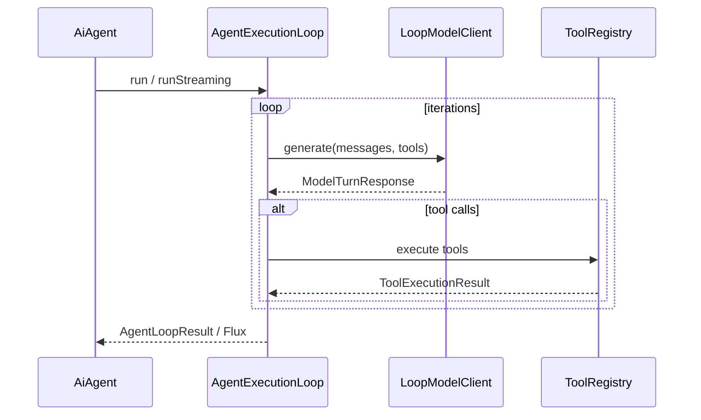

# Developer guide

_Author: Vaquar Khan_

This document is the **technical reference** for **ai-agent-java-sdk-core**: architecture, extension points, configuration, tools, MCP composition, observability, and failure modes. For a step-by-step walkthrough, see [tutorial.md](tutorial.md). For positioning and external links, see [README.md](../README.md).

---

## Documentation map

| Document | Purpose |
|----------|---------|
| [README.md](../README.md) | Why this module exists, benefits, quick Maven/YAML |
| [python-strands-vs-ai-agent-java.md](python-strands-vs-ai-agent-java.md) | AWS Strands (Python) vs AI Agent Java SDK: side-by-side table |
| [tutorial.md](tutorial.md) | Hands-on path: config, tools, MCP, streaming, hardening |
| This file | Internals-oriented reference for contributors and integrators |

---

## Core architecture

The module exposes a **`AiAgent`** that delegates to **`AgentExecutionLoop`**. One **invocation** (sync or streaming) runs a loop until:

1. The model returns a **final** assistant message (no further tool calls), or
2. **`max-iterations`** is reached, or
3. A **model** or **infrastructure** error is raised (`AgentExecutionException`).

Each iteration:

1. Sends the current **system prompt** (from properties) plus **`ExecutionMessage`** history to **`LoopModelClient`** together with the list of **`ToolCallback`** instances from **`ToolRegistry`**.
2. If the model response requests tool invocations, **`ToolRegistry`** runs them (timeouts, size limits, optional rate limit) and appends **tool result** messages.
3. Repeats until termination.



### Tool discovery

**`ToolBridge`** is the single entry point for building a **`ToolRegistry`** from Spring’s **`ToolCallbackProvider`** list:

```java
ToolRegistry registry = ToolBridge.discoverTools(providers, properties);
```

- **`ToolBridge`** is a **static** utility; there is no instance API.
- **`AiAgentProperties`** supplies **`ToolDiscovery`** (globs) and **`Security`** (limits).

### Glob rules

- **`include-patterns`**: optional allowlist; empty means “include all” that are not excluded.
- **`exclude-patterns`**: deny list; **exclude always wins** over include.
- Matching uses Java **`PathMatcher`** **`glob:`** semantics against the tool **name** (not the description).
- Tool names must match **`[a-zA-Z0-9_-]+`**; invalid names are **skipped** with a warning.
- Duplicate names after filtering: **first registration wins**, later duplicates log a warning.

### Advisors

**`Advisor`** is a functional interface: **`apply(List<ExecutionMessage>, AgentExecutionContext)`**. Advisors run **before** the loop starts, in bean order, so you can inject session memory, RAG snippets, or safety preambles without changing the loop implementation.

### Execution context

**`AgentExecutionContext`** holds **`sessionId`**, optional **`userId`**, and **`headers`**. **`equals` / `hashCode` / `toString`** intentionally **omit** headers to reduce accidental leakage in logs. Use **`AgentExecutionContext.from(AgentCoreContext)`** when running inside AgentCore.

---

## Configuration reference

All properties use the prefix **`ai.agent`**.

| Property | Default | Notes |
|----------|---------|--------|
| `enabled` | `true` | When `false`, auto-configuration for this module’s beans can be skipped (see `@ConditionalOnProperty`). |
| `model-provider` | - | **Required.** Logical name for your stack (e.g. bedrock, openai). |
| `model-id` | - | **Required.** Model identifier; **hidden** from `/configprops`-style exposure via `@JsonIgnore`. |
| `system-prompt` | - | Mutually exclusive with `system-prompt-resource`. |
| `system-prompt-resource` | - | `classpath:` or file; **must not** use `http://` or `https://` (validation). |
| `max-iterations` | `25` | Must be `>= 1`. |
| `tool-discovery.enabled` | `true` | If `false`, **`ToolRegistry` is empty** (no tools). |
| `tool-discovery.include-patterns` | `[]` | Glob allowlist; empty = all (subject to exclude). |
| `tool-discovery.exclude-patterns` | `[]` | Glob denylist; wins over include. |
| `security.max-tool-argument-bytes` | `65536` | Argument size guard. |
| `security.tool-timeout-seconds` | `60` | Per tool invocation timeout. |
| `security.tool-rate-limit` | `0` | Max tool invocations per **agent loop**; `0` = unlimited. |
| `security.sanitize-tool-output` | `false` | Reduces sensitive data in traces when enabled. |
| `security.trace-max-output-length` | `1024` | Truncation for trace/log emission. |
| `security.trace-include-tool-data` | `false` | Whether tool payloads appear in traces. |

Validation is enforced by **`AiAgentProperties`** (Jakarta Validation) and **`AiAgentPropertiesValidator`** (used before execution).

---

## Auto-configuration

**`AiAgentAutoConfiguration`** (package `io.github.vaquarkhan.agent.config`) registers:

- **`ToolRegistry`** via **`ToolBridge.discoverTools`**
- **`LoopModelClient`** defaulting to **`NoopLoopModelClient`** (`@ConditionalOnMissingBean`)
- **`AgentExecutionLoop`**, **`AgentObservability`**, **`AiAgent`**
- **`MeterRegistry`** / **`ObservationRegistry`** NOOP or simple defaults if missing

Replace **`LoopModelClient`** in your application for real model traffic.

---

## Sync vs streaming

| API | Returns | Behavior |
|-----|---------|----------|
| **`AiAgent.execute`** | **`AgentResponse`** | Full loop; final text + trace metadata. |
| **`AiAgent.executeStreaming`** | **`Flux<String>`** | Token-style stream; **pauses** around tool execution boundaries then continues. |

---

## Observability

**`AgentObservability`** integrates with **Micrometer** and optional **Observation** APIs. Typical metrics include:

- **`ai.agent.iteration.count`** - iteration count distribution
- **`ai.agent.loop.duration`** - loop duration timer
- **`ai.agent.tool.invocations`** - tool invocation counter
- **`ai.agent.loop.max_iteration_termination`** - count when stopped by max iterations

Tool output in traces can be **sanitized** and **truncated** using **`security.*`** trace fields.

---

## MCP (Model Context Protocol) integration

This module does **not** embed an MCP client. It consumes whatever **`ToolCallbackProvider`** beans exist in the **Spring** context.

Recommended approach:

1. Use **Spring AI’s MCP client** support so MCP servers expose tools as **`ToolCallback`** instances (see [MCP Client Boot Starter](https://docs.spring.io/spring-ai/reference/api/mcp/mcp-client-boot-starter-docs.html) and [MCP utilities](https://docs.spring.io/spring-ai/reference/api/mcp/mcp-helpers.html)).
2. Rely on **`ToolBridge.discoverTools`** to merge MCP tools with application-defined tools.
3. Use **`tool-discovery`** globs to restrict which MCP-exposed tools participate in the Strands loop.

If multiple MCP servers register overlapping tool names, resolve conflicts in MCP/Spring AI configuration (prefix generators, filters) or adjust **`exclude-patterns`**.

---

## Error handling

| Situation | Behavior |
|-----------|----------|
| Tool throws or times out | Exposed to the model as **`ToolExecutionResult`** with **`success=false`** so the model can retry or explain. |
| Model / client failure | **`AgentExecutionException`** with iteration context and partial trace where available. |
| Max iterations | Termination reason **`MAX_ITERATIONS_REACHED`**; response still returns partial content/trace per implementation. |

---

## Conversation Managers

Conversation managers control the context window before each model call. Two built-in implementations are provided.

### SlidingWindowConversationManager

Keeps only the last N messages. Simple and efficient.

```java
// Default window size: 20
ConversationManager manager = new SlidingWindowConversationManager();

// Custom window size
ConversationManager manager = new SlidingWindowConversationManager(10);
```

Wire it into the execution loop:

```java
executionLoop.setConversationManager(new SlidingWindowConversationManager(15));
```

### TokenCountConversationManager

Estimates token count per message (characters / 4 approximation) and removes oldest messages until the total fits within a configured limit.

```java
// Default max tokens: 4096
ConversationManager manager = new TokenCountConversationManager();

// Custom limit
ConversationManager manager = new TokenCountConversationManager(2048);
```

---

## Session Managers

Session managers persist conversation messages across invocations for multi-turn conversations.

### InMemorySessionManager

`ConcurrentHashMap`-backed storage. Thread-safe. Useful for development and testing.

```java
SessionManager sessionManager = new InMemorySessionManager();
agent.setSessionManager(sessionManager);
```

### FileSessionManager

Saves sessions as JSON files in a configurable directory. Uses Jackson `ObjectMapper` for serialization and file locking for thread safety.

```java
SessionManager sessionManager = new FileSessionManager(
    Path.of("/var/sessions"), new ObjectMapper());
agent.setSessionManager(sessionManager);
```

File naming: `{sessionId}.json` in the configured directory.

### DynamoDB Session Manager (Extension Point)

A DynamoDB-backed session manager is out of scope for this module since it requires the AWS SDK dependency. To implement one, add the AWS SDK to your project and implement the `SessionManager` interface. The `save`/`load`/`delete`/`exists` contract maps directly to DynamoDB `PutItem`/`GetItem`/`DeleteItem`/`GetItem` operations.

---

## Steering System

Steering rules conditionally inject instructions into the conversation based on keyword matching against the user prompt.

### SteeringRule

A record with `name`, `condition` (keyword), and `instruction` (text to prepend).

### SteeringAdvisor

An `Advisor` implementation that evaluates rules and prepends matching instructions as system messages. Condition matching is case-insensitive.

```java
List<SteeringRule> rules = List.of(
    new SteeringRule("code-rule", "code", "Always include code examples."),
    new SteeringRule("security-rule", "security", "Follow OWASP guidelines.")
);
SteeringAdvisor advisor = new SteeringAdvisor(rules);
// Register as an Advisor bean or pass to AiAgent
```

---

## Skills Plugin

Skills are reusable prompt + tool combinations loaded by `SkillsPlugin`.

### Skill Record

```java
Skill skill = new Skill(
    "web-search",
    "Web search capability",
    "You can search the web using the web_search tool.",
    List.of("web_search")
);
```

### SkillsPlugin

```java
SkillsPlugin plugin = new SkillsPlugin(List.of(skill1, skill2));
Advisor skillsAdvisor = plugin.createAdvisor();
// The advisor prepends skill prompt fragments as system messages
```

---

## Hook Annotation (@OnHook)

Methods annotated with `@OnHook` are automatically discovered and registered as hooks.

```java
public class MyPlugin implements AgentPlugin {
    @OnHook(AgentHookEvent.BeforeModelCall.class)
    public void onBeforeModel(AgentHookEvent event) {
        // handle event
    }

    @Override
    public void init(AiAgent agent) { }
}
```

`HookAnnotationProcessor` scans a bean for `@OnHook` methods and registers them with the `HookRegistry`. Methods must accept exactly one `AgentHookEvent` parameter; methods with incorrect signatures are skipped with a warning.

---

## Plugin Scanner

`PluginScanner` scans a `AgentPlugin` implementation for auto-discoverable features:

- `@OnHook` annotated methods are registered as hooks
- Methods returning `ToolCallbackProvider` are detected as tool providers

```java
PluginScanner scanner = new PluginScanner(hookRegistry);
PluginScanner.ScanResult result = scanner.scan(myPlugin);
// result.hooksRegistered() - number of hooks found
// result.toolProviders() - number of tool provider methods found
```

---

## Directory Tool Loader

`DirectoryToolLoader` watches a directory for `.json` tool definition files and maintains a live map of shell-command-based tools.

### JSON Tool Definition Format

```json
{
    "name": "my_tool",
    "description": "Does something useful",
    "command": "echo hello"
}
```

### Usage

```java
DirectoryToolLoader loader = new DirectoryToolLoader(
    Path.of("/tools"), new ObjectMapper());
loader.loadInitial();       // scan directory
loader.startWatching();     // watch for changes (background thread)

Map<String, ToolCallback> tools = loader.getTools();
```

When files are added, removed, or modified, the internal tool map is updated automatically via Java `WatchService`.

---

## Dynamic MCP Client

`DynamicMcpToolConnector` provides a facade for connecting to MCP servers at runtime (not just at startup).

```java
DynamicMcpToolConnector connector = new DynamicMcpToolConnector(mcpClientFactory);

// Connect via stdio
connector.connect("mcp-db", McpConnectionConfig.stdio("python", List.of("db_server.py")));

// Connect via SSE
connector.connect("mcp-api", McpConnectionConfig.sse(
    "http://localhost:8080", Map.of("Authorization", "Bearer token")));

// List active connections
Set<String> active = connector.listConnections();

// Disconnect
connector.disconnect("mcp-db");
```

The connector manages connection lifecycle. Actual MCP client creation is delegated to a `McpClientFactory` implementation that wraps Spring AI MCP infrastructure.

---

## Testing

- Replace **`LoopModelClient`** with a test double that returns scripted **`ModelTurnResponse`** instances.
- Provide **`ToolCallbackProvider`** beans with small **`ToolCallback`** fakes (see tests under `src/test/java` for patterns).
- Use **`@SpringBootTest`** with **`AiAgentAutoConfiguration`** and property overrides for **`ai.agent.model-provider`** / **`model-id`**.

---

## Version alignment

This library depends on **`spring-ai-core`** from the Spring AI BOM your parent POM imports. **`LoopModelClient`** must match your Spring AI **message** and **tool call** representations. When upgrading Spring AI, re-validate your `LoopModelClient` adapter and MCP artifacts together.
