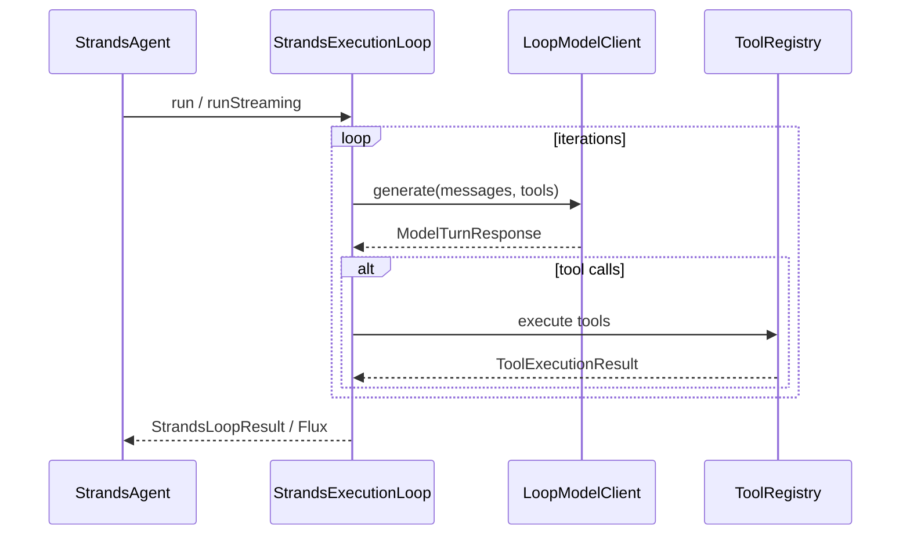

# Developer guide

_Author: Vaquar Khan_

This document is the **technical reference** for **spring-ai-strands-agentcore-sdk**: architecture, extension points, configuration, tools, MCP composition, observability, and failure modes. For a step-by-step walkthrough, see [tutorial.md](tutorial.md). For positioning and external links, see [README.md](../README.md).

---

## Documentation map

| Document | Purpose |
|----------|---------|
| [README.md](../README.md) | Why this module exists, benefits, quick Maven/YAML |
| [strands-python-vs-spring-ai.md](strands-python-vs-spring-ai.md) | Strands (Python) vs Strands-style on Spring AI: side-by-side table |
| [tutorial.md](tutorial.md) | Hands-on path: config, tools, MCP, streaming, hardening |
| This file | Internals-oriented reference for contributors and integrators |

---

## Core architecture

The module exposes a **`StrandsAgent`** that delegates to **`StrandsExecutionLoop`**. One **invocation** (sync or streaming) runs a loop until:

1. The model returns a **final** assistant message (no further tool calls), or
2. **`max-iterations`** is reached, or
3. A **model** or **infrastructure** error is raised (`StrandsExecutionException`).

Each iteration:

1. Sends the current **system prompt** (from properties) plus **`ExecutionMessage`** history to **`LoopModelClient`** together with the list of **`ToolCallback`** instances from **`ToolRegistry`**.
2. If the model response requests tool invocations, **`ToolRegistry`** runs them (timeouts, size limits, optional rate limit) and appends **tool result** messages.
3. Repeats until termination.



### Tool discovery

**`ToolBridge`** is the single entry point for building a **`ToolRegistry`** from Spring’s **`ToolCallbackProvider`** list:

```java
ToolRegistry registry = ToolBridge.discoverTools(providers, properties);
```

- **`ToolBridge`** is a **static** utility; there is no instance API.
- **`StrandsAgentProperties`** supplies **`ToolDiscovery`** (globs) and **`Security`** (limits).

### Glob rules

- **`include-patterns`**: optional allowlist; empty means “include all” that are not excluded.
- **`exclude-patterns`**: deny list; **exclude always wins** over include.
- Matching uses Java **`PathMatcher`** **`glob:`** semantics against the tool **name** (not the description).
- Tool names must match **`[a-zA-Z0-9_-]+`**; invalid names are **skipped** with a warning.
- Duplicate names after filtering: **first registration wins**, later duplicates log a warning.

### Advisors

**`Advisor`** is a functional interface: **`apply(List<ExecutionMessage>, StrandsExecutionContext)`**. Advisors run **before** the loop starts, in bean order, so you can inject session memory, RAG snippets, or safety preambles without changing the loop implementation.

### Execution context

**`StrandsExecutionContext`** holds **`sessionId`**, optional **`userId`**, and **`headers`**. **`equals` / `hashCode` / `toString`** intentionally **omit** headers to reduce accidental leakage in logs. Use **`StrandsExecutionContext.from(AgentCoreContext)`** when running inside AgentCore.

---

## Configuration reference

All properties use the prefix **`strands.agent`**.

| Property | Default | Notes |
|----------|---------|--------|
| `enabled` | `true` | When `false`, auto-configuration for this module’s beans can be skipped (see `@ConditionalOnProperty`). |
| `model-provider` | — | **Required.** Logical name for your stack (e.g. bedrock, openai). |
| `model-id` | — | **Required.** Model identifier; **hidden** from `/configprops`-style exposure via `@JsonIgnore`. |
| `system-prompt` | — | Mutually exclusive with `system-prompt-resource`. |
| `system-prompt-resource` | — | `classpath:` or file; **must not** use `http://` or `https://` (validation). |
| `max-iterations` | `25` | Must be `>= 1`. |
| `tool-discovery.enabled` | `true` | If `false`, **`ToolRegistry` is empty** (no tools). |
| `tool-discovery.include-patterns` | `[]` | Glob allowlist; empty = all (subject to exclude). |
| `tool-discovery.exclude-patterns` | `[]` | Glob denylist; wins over include. |
| `security.max-tool-argument-bytes` | `65536` | Argument size guard. |
| `security.tool-timeout-seconds` | `60` | Per tool invocation timeout. |
| `security.tool-rate-limit` | `0` | Max tool invocations per **agent loop**; `0` = unlimited. |
| `security.sanitize-tool-output` | `false` | Reduces sensitive data in traces when enabled. |
| `security.trace-max-output-length` | `1024` | Truncation for trace/log emission. |
| `security.trace-include-tool-data` | `false` | Whether tool payloads appear in traces. |

Validation is enforced by **`StrandsAgentProperties`** (Jakarta Validation) and **`StrandsAgentPropertiesValidator`** (used before execution).

---

## Auto-configuration

**`StrandsAgentAutoConfiguration`** (package `com.example.spring.ai.strands.agent.config`) registers:

- **`ToolRegistry`** via **`ToolBridge.discoverTools`**
- **`LoopModelClient`** defaulting to **`NoopLoopModelClient`** (`@ConditionalOnMissingBean`)
- **`StrandsExecutionLoop`**, **`StrandsObservability`**, **`StrandsAgent`**
- **`MeterRegistry`** / **`ObservationRegistry`** NOOP or simple defaults if missing

Replace **`LoopModelClient`** in your application for real model traffic.

---

## Sync vs streaming

| API | Returns | Behavior |
|-----|---------|----------|
| **`StrandsAgent.execute`** | **`StrandsAgentResponse`** | Full loop; final text + trace metadata. |
| **`StrandsAgent.executeStreaming`** | **`Flux<String>`** | Token-style stream; **pauses** around tool execution boundaries then continues. |

---

## Observability

**`StrandsObservability`** integrates with **Micrometer** and optional **Observation** APIs. Typical metrics include:

- **`strands.iteration.count`** — iteration count distribution
- **`strands.loop.duration`** — loop duration timer
- **`strands.tool.invocations`** — tool invocation counter
- **`strands.loop.max_iteration_termination`** — count when stopped by max iterations

Tool output in traces can be **sanitized** and **truncated** using **`security.*`** trace fields.

---

## MCP (Model Context Protocol) integration

This module does **not** embed an MCP client. It consumes whatever **`ToolCallbackProvider`** beans exist in the **Spring** context.

Recommended approach:

1. Use **Spring AI’s MCP client** support so MCP servers expose tools as **`ToolCallback`** instances (see [MCP Client Boot Starter](https://docs.spring.io/spring-ai/reference/api/mcp/mcp-client-boot-starter-docs.html) and [MCP utilities](https://docs.spring.io/spring-ai/reference/api/mcp/mcp-helpers.html)).
2. Rely on **`ToolBridge.discoverTools`** to merge MCP tools with application-defined tools.
3. Use **`tool-discovery`** globs to restrict which MCP-exposed tools participate in the Strands loop.

If multiple MCP servers register overlapping tool names, resolve conflicts in MCP/Spring AI configuration (prefix generators, filters) or adjust **`exclude-patterns`**.

---

## Error handling

| Situation | Behavior |
|-----------|----------|
| Tool throws or times out | Exposed to the model as **`ToolExecutionResult`** with **`success=false`** so the model can retry or explain. |
| Model / client failure | **`StrandsExecutionException`** with iteration context and partial trace where available. |
| Max iterations | Termination reason **`MAX_ITERATIONS_REACHED`**; response still returns partial content/trace per implementation. |

---

## Testing

- Replace **`LoopModelClient`** with a test double that returns scripted **`ModelTurnResponse`** instances.
- Provide **`ToolCallbackProvider`** beans with small **`ToolCallback`** fakes (see tests under `src/test/java` for patterns).
- Use **`@SpringBootTest`** with **`StrandsAgentAutoConfiguration`** and property overrides for **`strands.agent.model-provider`** / **`model-id`**.

---

## Version alignment

This library depends on **`spring-ai-core`** from the Spring AI BOM your parent POM imports. **`LoopModelClient`** must match your Spring AI **message** and **tool call** representations. When upgrading Spring AI, re-validate your `LoopModelClient` adapter and MCP artifacts together.
