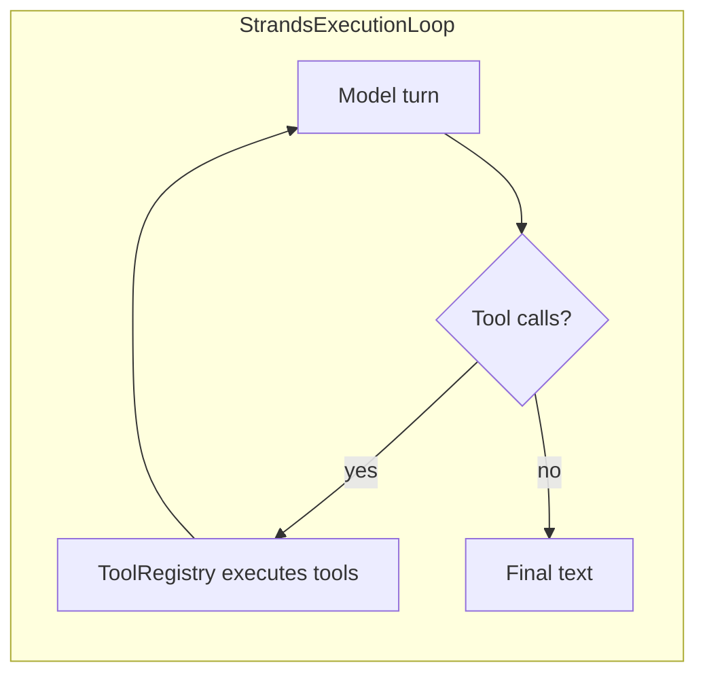

# Tutorial: Strands-style agents with Spring AI

_Author: Vaquar Khan_

This tutorial mirrors the **mental model** of the [Strands Agents SDK](https://strandsagents.com/) (Python and TypeScript): you combine a **foundation model**, a **system prompt**, and **tools**; the runtime runs a **loop** where the model may call tools until it returns a final answer. Here, that loop is implemented by **spring-ai-strands-agentcore-sdk** on top of **Spring Boot** and **Spring AI**.

For architecture details and property reference, see [developer-guide.md](developer-guide.md). For product context and links, see the module [README.md](../README.md).

---

## What you will learn

1. How Strands concepts map to this Java module.
2. How to configure `strands.agent.*` and inject `StrandsAgent`.
3. How to supply a real **`LoopModelClient`** (the model behind the loop).
4. How to register **custom tools** and **filter** them with glob patterns.
5. How **MCP (Model Context Protocol)** tools appear as Spring AI `ToolCallbackProvider` beans and participate in the same loop.
6. How to expose **streaming** (`Flux<String>`) for HTTP SSE-style APIs.
7. How to **tighten** limits for production workloads.

---

## Strands (Python/TS) vs this SDK (Java)

| Strands (Python/TS) idea | In Spring AI + this module |
|--------------------------|----------------------------|
| Agent object wrapping model + tools | `StrandsAgent` + `StrandsExecutionLoop` |
| Tool / function the model can call | `ToolCallback` (Spring AI) |
| Registering tools with the runtime | `ToolCallbackProvider` beans; `ToolBridge.discoverTools` builds a `ToolRegistry` |
| System prompt | `strands.agent.system-prompt` or `system-prompt-resource` |
| Session / user for memory or HTTP | `StrandsExecutionContext` (optionally from AgentCore `AgentCoreContext`) |
| Optional prompt enrichment (memory, RAG) | `Advisor` beans applied before the loop |
| External MCP servers exposing tools | Spring AI MCP client starter → `SyncMcpToolCallbackProvider` / auto-configured `ToolCallbackProvider` |

A wider **side-by-side** (language runtime, configuration style, streaming, observability, multi-agent scope) is in [strands-python-vs-spring-ai.md](strands-python-vs-spring-ai.md).

This module **does not** reimplement Strands’ Python-only packages (multi-agent swarms, workflow graphs, and so on). Those belong in separate orchestration or in **spring-ai-a2a**; here you get a **single** model-driven loop you can call from controllers or AgentCore invocations.

---

## Prerequisites

- Java 17+
- Spring Boot 3.x application with **Spring AI** on the classpath (BOM-managed `spring-ai-core`, plus your chat-model starter such as Bedrock, OpenAI, Ollama, etc.).
- Dependency on **`spring-ai-strands-agentcore-sdk`** (coordinates match your parent POM).

Auto-configuration imports `StrandsAgentAutoConfiguration` when `strands.agent.enabled` is true (default).

---

## The execution loop (overview)



Each **iteration** is: send messages and tool definitions to `LoopModelClient` → if the model requests tools, run them through `ToolRegistry` → append tool results → call the model again, until the model finishes, an error occurs, or `max-iterations` is reached.

---

## Part 1: Minimal synchronous agent

### 1.1 Configuration

```yaml
strands:
  agent:
    model-provider: bedrock
    model-id: "anthropic.claude-3-5-sonnet-20240620-v1:0"
    system-prompt: "You are a helpful assistant. Answer clearly and cite tools when you use them."
    max-iterations: 20
```

`model-provider` and `model-id` are **required** and are validated at startup. They describe your deployment; the actual chat traffic goes through **`LoopModelClient`**, which you must wire to Spring AI (see below).

### 1.2 Call the agent

```java
import com.example.spring.ai.strands.agent.StrandsAgent;
import com.example.spring.ai.strands.agent.execution.StrandsExecutionContext;
import com.example.spring.ai.strands.agent.model.StrandsAgentResponse;

// injected
StrandsAgent strandsAgent;

StrandsAgentResponse response = strandsAgent.execute(
    "Summarize virtual threads in Java in three bullets.",
    StrandsExecutionContext.standalone("session-1")
);

String answer = response.content();
```

`StrandsAgentResponse` also carries `reasoningTrace()`, `terminationReason()`, `iterationCount()`, and `totalDuration()` for observability and debugging.

### 1.3 Provide a real `LoopModelClient`

Auto-configuration registers **`NoopLoopModelClient`** if you do not define your own bean. That is only useful for tests. For production, declare a `@Bean` of type **`LoopModelClient`** that delegates to **`ChatClient`** (or another client), mapping `ExecutionMessage` lists to Spring AI messages and mapping the model response to **`ModelTurnResponse`** (including tool-call payloads the loop understands).

Keep this adapter in **your application** or a shared integration module so it matches your exact Spring AI version and model features.

---

## Part 2: System prompt from a file

Strands samples often load prompts from files; the same applies here.

- Use **`strands.agent.system-prompt`** for inline text, **or**
- Use **`strands.agent.system-prompt-resource`** for `classpath:` or filesystem resources.

They are **mutually exclusive**. Remote `http://` / `https://` URLs are **rejected** for the resource variant to reduce SSRF risk.

```yaml
strands:
  agent:
    system-prompt-resource: "classpath:prompts/agent-system.txt"
```

---

## Part 3: Custom tools

Tools are plain Spring AI **`ToolCallback`** instances grouped by **`ToolCallbackProvider`**.

### 3.1 Implement a provider

```java
import java.util.List;
import org.springframework.ai.tool.ToolCallback;
import org.springframework.ai.tool.ToolCallbackProvider;
import org.springframework.context.annotation.Bean;
import org.springframework.context.annotation.Configuration;

@Configuration
public class WeatherToolsConfig {

    @Bean
    public ToolCallbackProvider weatherTools() {
        return () -> List.of(
                new MyWeatherToolCallback() // implements ToolCallback
        );
    }
}
```

Name tools with characters in `[a-zA-Z0-9_-]` only; other names are skipped with a warning.

### 3.2 Filter tools with globs (Strands-style “only these tools”)

This matches the idea of narrowing which functions the model sees:

```yaml
strands:
  agent:
    tool-discovery:
      enabled: true
      include-patterns: [ "weather_*", "lookup_*" ]
      exclude-patterns: [ "weather_debug" ]
```

Rules (see [developer-guide.md](developer-guide.md)):

- **Exclude wins over include** (deny-over-allow).
- Empty `include-patterns` means “all tools that pass exclude”.
- Patterns are **glob** matches against the tool **name**.

### 3.3 Browser, code interpreter, and other AgentCore tools

If **spring-ai-agentcore** (or your stack) exposes browser or code tools as **`ToolCallbackProvider`** beans, they are discovered the same way. Restrict them with `include-patterns` / `exclude-patterns` so the model only sees what you intend.

---

## Part 4: MCP agents and MCP-backed tools

Strands’ ecosystem often uses **MCP** so agents can call capabilities hosted in separate processes (databases, browsers, enterprise APIs). In Spring AI, MCP clients expose tools through **`ToolCallbackProvider`** implementations such as **`SyncMcpToolCallbackProvider`** or **`AsyncMcpToolCallbackProvider`**, or via the MCP client Boot starter’s auto-configuration.

### 4.1 Conceptual wiring

1. Add the **Spring AI MCP client** dependency and configuration your BOM supports (see [MCP Client Boot Starter](https://docs.spring.io/spring-ai/reference/api/mcp/mcp-client-boot-starter-docs.html)).
2. Configure MCP servers (stdio, SSE, etc.) under `spring.ai.mcp.client` as documented for your Spring AI version.
3. With **`spring.ai.mcp.client.toolcallback.enabled=true`** (default in current docs), MCP tools are registered as **`ToolCallbackProvider`** beans that this SDK’s **`ToolBridge`** already picks up.
4. Optionally narrow which MCP tools the Strands loop sees using **`tool-discovery`** globs (for example include `mcp_*` or server-specific prefixes if your stack adds them).

### 4.2 Combining MCP with custom tools

You may have **multiple** `ToolCallbackProvider` beans: one from MCP, one for in-app `@Tool` methods, one hand-written. `ToolBridge` merges them; **duplicate tool names** after filtering log a warning and keep the first registration.

### 4.3 When to disable MCP tool callbacks

If you need MCP for resources but not for Strands tool execution, disable the MCP **`ToolCallbackProvider`** auto-configuration with `spring.ai.mcp.client.toolcallback.enabled=false` and register only the providers you want.

---

## Part 5: Streaming and HTTP (SSE)

For token-style streaming suitable for **Server-Sent Events**, use:

```java
import org.springframework.http.MediaType;
import org.springframework.web.bind.annotation.GetMapping;
import org.springframework.web.bind.annotation.RequestParam;
import org.springframework.web.bind.annotation.RestController;
import reactor.core.publisher.Flux;

@RestController
public class AgentStreamController {

    private final StrandsAgent strandsAgent;

    public AgentStreamController(StrandsAgent strandsAgent) {
        this.strandsAgent = strandsAgent;
    }

    @GetMapping(value = "/api/agent/stream", produces = MediaType.TEXT_EVENT_STREAM_VALUE)
    public Flux<String> stream(@RequestParam String q) {
        return strandsAgent.executeStreaming(q, StrandsExecutionContext.standalone("stream-session"));
    }
}
```

The loop **pauses** streaming while tools run, then **resumes** with model output, which aligns with typical SSE expectations for AgentCore-style runtimes.

---

## Part 6: Advisors (memory and RAG-style enrichment)

Implement **`Advisor`** to rewrite or append to the initial `ExecutionMessage` list using **`StrandsExecutionContext`** (session id, user id, headers). AgentCore integrations often use this hook to attach **memory** or **retrieved context** before the first model call.

```java
@Bean
public Advisor sessionScopedHintAdvisor() {
    return (messages, ctx) -> {
        // load memory for ctx.getSessionId(), prepend system snippets, etc.
        return messages;
    };
}
```

---

## Part 7: Production hardening

Tune limits to match latency budgets and abuse tolerance:

```yaml
strands:
  agent:
    max-iterations: 12
    security:
      max-tool-argument-bytes: 16384
      tool-timeout-seconds: 20
      tool-rate-limit: 10
      sanitize-tool-output: true
      trace-max-output-length: 512
      trace-include-tool-data: false
```

Pair with **Micrometer** dashboards and your **tracing** backend; `StrandsObservability` emits loop and tool metrics (see [developer-guide.md](developer-guide.md)).

---

## Part 8: Troubleshooting

| Symptom | Things to check |
|--------|------------------|
| No model output / noop behavior | You did not replace **`NoopLoopModelClient`** with a real **`LoopModelClient`**. |
| Tools never called | Tool discovery disabled; globs exclude all tools; tool names invalid; duplicate names skipped. |
| Validation error at startup | Missing `model-provider` / `model-id`; both `system-prompt` and `system-prompt-resource` set; HTTP URL for prompt resource. |
| MCP tools missing | MCP starter not on classpath; `toolcallback.enabled=false`; glob filters too strict; MCP server not connected. |

---

## Next steps

- Run the runnable examples under [examples/README.md](../examples/README.md): **python-quickstart-agent** (full Python quickstart port), **calculator-minimal-agent** (single-tool minimal), **streaming-sse-agent** (SSE streaming), **tool-discovery-filter-agent** (glob include/exclude).
- Read [developer-guide.md](developer-guide.md) for the full configuration matrix and observability list.
- Align **`LoopModelClient`** with your Spring AI chat model configuration (Bedrock, OpenAI, Ollama, etc.).
