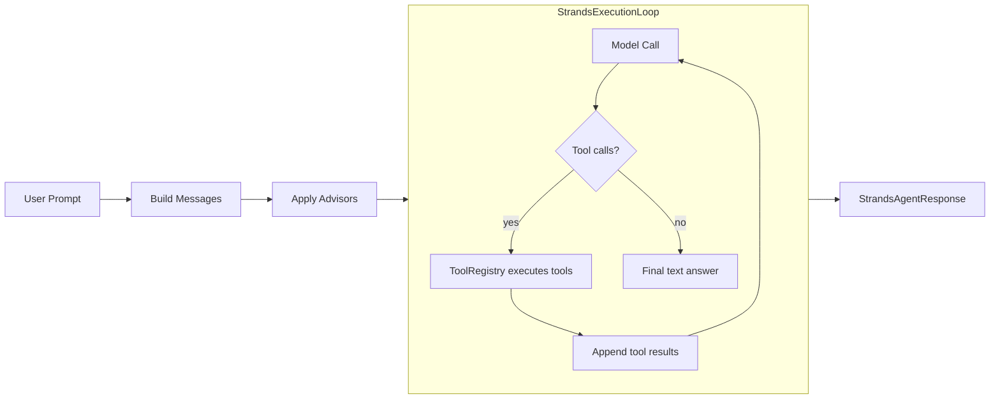

# Comprehensive Tutorial: Strands-Style Agents with Spring AI

_Author: Vaquar Khan_

This tutorial walks you through every feature of the **spring-ai-strands-agentcore-sdk** from first principles to production hardening. It mirrors the mental model of the [Strands Agents SDK](https://strandsagents.com/) (Python): you combine a foundation model, a system prompt, and tools; the runtime runs a loop where the model may call tools until it returns a final answer. Here, that loop is implemented on top of Spring Boot and Spring AI.

If you have used the Python Strands quickstart, you will feel at home. Every concept maps directly, and this tutorial shows the Python equivalent alongside the Java code where it helps understanding.

For architecture details and property reference, see [developer-guide.md](developer-guide.md). For the side-by-side comparison document, see [strands-python-vs-spring-ai.md](strands-python-vs-spring-ai.md).

---

## Table of Contents

- [Part 1: Getting Started](#part-1-getting-started)
- [Part 2: The Execution Loop](#part-2-the-execution-loop)
- [Part 3: System Prompts](#part-3-system-prompts)
- [Part 4: Custom Tools](#part-4-custom-tools)
- [Part 5: Tool Discovery and Filtering](#part-5-tool-discovery-and-filtering)
- [Part 6: Parallel Tool Execution](#part-6-parallel-tool-execution)
- [Part 7: MCP Tool Integration](#part-7-mcp-tool-integration)
- [Part 8: Directory Tool Loading](#part-8-directory-tool-loading)
- [Part 9: Streaming (SSE)](#part-9-streaming-sse)
- [Part 10: Hook System](#part-10-hook-system)
- [Part 11: Plugin System](#part-11-plugin-system)
- [Part 12: Skills](#part-12-skills)
- [Part 13: Steering Rules](#part-13-steering-rules)
- [Part 14: Conversation Management](#part-14-conversation-management)
- [Part 15: Session Persistence](#part-15-session-persistence)
- [Part 16: Observability and Debugging](#part-16-observability-and-debugging)
- [Part 17: Retry Logic](#part-17-retry-logic)
- [Part 18: Security Hardening](#part-18-security-hardening)
- [Part 19: Advisors (Memory and RAG)](#part-19-advisors-memory-and-rag)
- [Part 20: Troubleshooting](#part-20-troubleshooting)
- [Part 21: Python Strands to Java Migration Guide](#part-21-python-strands-to-java-migration-guide)

---

## Prerequisites

- Java 17+
- Spring Boot 3.x with Spring AI on the classpath (BOM-managed `spring-ai-core`, plus your chat-model starter such as Bedrock, OpenAI, Ollama, etc.)
- Maven or Gradle build tool
- AWS credentials configured if using Amazon Bedrock (environment variables, `~/.aws/credentials`, or IAM roles)

---

## Part 1: Getting Started

### 1.1 Maven Dependency

Add the SDK to your `pom.xml`:

```xml
<dependency>
    <groupId>com.example.spring.ai</groupId>
    <artifactId>spring-ai-strands-agentcore-sdk</artifactId>
    <version>0.1.0-SNAPSHOT</version>
</dependency>
```

You also need a Spring AI chat model starter. For example, with Amazon Bedrock:

```xml
<dependency>
    <groupId>org.springframework.ai</groupId>
    <artifactId>spring-ai-bedrock-ai-spring-boot-starter</artifactId>
</dependency>
```

**Python equivalent** - In Python Strands, you install with pip:

```python
pip install strands-agents strands-agents-tools
```

### 1.2 Minimal application.yml

```yaml
strands:
  agent:
    enabled: true
    model-provider: bedrock
    model-id: "anthropic.claude-3-5-sonnet-20240620-v1:0"
    system-prompt: "You are a helpful assistant. Answer clearly and cite tools when you use them."
    max-iterations: 25
```

`model-provider` and `model-id` are required and validated at startup. `max-iterations` defaults to 25 if not set.

### 1.3 Creating Your First Agent

Auto-configuration registers a `StrandsAgent` bean when `strands.agent.enabled` is true (the default). You can inject it directly:

```java
import com.example.spring.ai.strands.agent.StrandsAgent;
import com.example.spring.ai.strands.agent.execution.StrandsExecutionContext;
import com.example.spring.ai.strands.agent.model.StrandsAgentResponse;
import org.springframework.web.bind.annotation.GetMapping;
import org.springframework.web.bind.annotation.RequestParam;
import org.springframework.web.bind.annotation.RestController;

@RestController
public class AgentController {

    private final StrandsAgent agent;

    public AgentController(StrandsAgent agent) {
        this.agent = agent;
    }

    @GetMapping("/ask")
    public String ask(@RequestParam String q) {
        StrandsAgentResponse response = agent.execute(
            q,
            StrandsExecutionContext.standalone("session-1")
        );
        return response.content();
    }
}
```

**Python equivalent** - The same concept in Python Strands:

```python
from strands import Agent

agent = Agent()
result = agent("Summarize virtual threads in Java in three bullets.")
print(result)
```

### 1.4 Providing a Real LoopModelClient

Auto-configuration registers a `NoopLoopModelClient` if you do not define your own bean. That is only useful for tests. For production, declare a `@Bean` of type `LoopModelClient` that delegates to Spring AI's `ChatClient`:

```java
import com.example.spring.ai.strands.agent.execution.ExecutionMessage;
import com.example.spring.ai.strands.agent.execution.LoopModelClient;
import com.example.spring.ai.strands.agent.execution.ModelTurnResponse;
import com.example.spring.ai.strands.agent.execution.stream.StreamEvent;
import org.springframework.ai.chat.client.ChatClient;
import org.springframework.ai.tool.ToolCallback;
import org.springframework.context.annotation.Bean;
import org.springframework.context.annotation.Configuration;
import reactor.core.publisher.Flux;

import java.util.List;

@Configuration
public class ModelClientConfig {

    @Bean
    public LoopModelClient loopModelClient(ChatClient.Builder chatClientBuilder) {
        ChatClient chatClient = chatClientBuilder.build();
        return new LoopModelClient() {
            @Override
            public ModelTurnResponse generate(
                    List<ExecutionMessage> messages,
                    List<ToolCallback> tools) {
                // Map ExecutionMessage list to Spring AI messages,
                // call chatClient, and map the response to ModelTurnResponse.
                // Return ModelTurnResponse.finalAnswer(text) for text,
                // or ModelTurnResponse.toolCall(name, args) for tool calls.
                throw new UnsupportedOperationException("Implement for your model");
            }

            @Override
            public Flux<StreamEvent> stream(
                    List<ExecutionMessage> messages,
                    List<ToolCallback> tools) {
                // Map to streaming Spring AI calls and emit StreamEvent instances.
                throw new UnsupportedOperationException("Implement for your model");
            }
        };
    }
}
```

### 1.5 Understanding the Response

`StrandsAgentResponse` is a record with five fields:

```java
public record StrandsAgentResponse(
    String content,                      // The final text answer
    ReasoningTrace reasoningTrace,       // Full trace of every iteration
    TerminationReason terminationReason, // Why the loop stopped
    int iterationCount,                  // How many iterations ran
    Duration totalDuration               // Wall-clock time for the entire loop
) {}
```

`TerminationReason` is an enum with three values:

| Value | Meaning |
|-------|---------|
| `MODEL_COMPLETION` | The model returned a final answer normally |
| `MAX_ITERATIONS_REACHED` | The loop hit the configured `max-iterations` limit |
| `ERROR` | An exception occurred during execution |

Example usage:

```java
StrandsAgentResponse response = agent.execute(
    "What is 2 + 2?",
    StrandsExecutionContext.standalone("session-1")
);

System.out.println("Answer: " + response.content());
System.out.println("Iterations: " + response.iterationCount());
System.out.println("Duration: " + response.totalDuration().toMillis() + "ms");
System.out.println("Reason: " + response.terminationReason());
```


---

## Part 2: The Execution Loop

### 2.1 How the Loop Works

The execution loop is the heart of the SDK. It follows the same model-tool-model cycle as Python Strands:



### 2.2 What Happens at Each Iteration

Each iteration follows these steps:

1. **Conversation management** - If a `ConversationManager` is configured, it trims the message history to fit within context limits.
2. **System prompt prepend** - The system prompt is prepended to the message list.
3. **Before-model-call hook** - The `BeforeModelCall` hook event fires.
4. **Model call** - The `LoopModelClient.generate()` method is called with messages and tool definitions.
5. **After-model-call hook** - The `AfterModelCall` hook event fires with the model response.
6. **Tool execution** - If the model requested tool calls, each tool is executed through `ToolRegistry`. For parallel tool calls, `executeToolsParallel()` is used.
7. **Before/after tool hooks** - `BeforeToolCall` and `AfterToolCall` events fire around each tool execution.
8. **Observability recording** - Each iteration is recorded in the `ReasoningTrace`.
9. **Loop or exit** - If tools were called, go back to step 1. If the model returned a final answer, exit.

### 2.3 Max Iterations and Termination

The loop terminates when one of three things happens:

- The model returns a final text answer (no tool calls) - `MODEL_COMPLETION`
- The iteration count reaches `max-iterations` - `MAX_ITERATIONS_REACHED`
- An exception is thrown - `ERROR` (wrapped in `StrandsExecutionException`)

```yaml
strands:
  agent:
    max-iterations: 12  # Lower for latency-sensitive workloads
```

If the loop hits `max-iterations`, any partial content accumulated so far is returned in the response.

---

## Part 3: System Prompts

### 3.1 Inline System Prompt

The simplest approach - set the prompt directly in `application.yml`:

```yaml
strands:
  agent:
    system-prompt: "You are a helpful coding assistant. Always explain your reasoning step by step."
```

### 3.2 System Prompt from a Classpath File

For longer prompts, load from a file:

```yaml
strands:
  agent:
    system-prompt-resource: "classpath:prompts/agent-system.txt"
```

Then create `src/main/resources/prompts/agent-system.txt`:

```text
You are a helpful coding assistant.
Always explain your reasoning step by step.
When you use a tool, explain why you chose it.
Format code examples with proper syntax highlighting.
```

You can also use filesystem paths:

```yaml
strands:
  agent:
    system-prompt-resource: "file:/opt/config/agent-prompt.txt"
```

### 3.3 Mutual Exclusivity Rule

You cannot set both `system-prompt` and `system-prompt-resource` at the same time. The SDK validates this at startup and throws an `IllegalArgumentException` if both are present.

### 3.4 SSRF Prevention

The `system-prompt-resource` property rejects `http://` and `https://` URLs to prevent Server-Side Request Forgery. Only `classpath:` and `file:` schemes are allowed. Attempting to use a remote URL causes a validation error at startup.

---

## Part 4: Custom Tools

Tools are how the agent interacts with the outside world. In Python Strands, you use the `@tool` decorator. In this SDK, you implement Spring AI's `ToolCallback` interface and register tools through `ToolCallbackProvider` beans.

### 4.1 Creating a ToolCallback

Each tool needs a `ToolDefinition` (name, description, input schema) and a `call()` method:

```java
import org.springframework.ai.tool.ToolCallback;
import org.springframework.ai.tool.definition.DefaultToolDefinition;
import org.springframework.ai.tool.definition.ToolDefinition;

public class CalculatorToolCallback implements ToolCallback {

    @Override
    public ToolDefinition getToolDefinition() {
        return DefaultToolDefinition.builder()
            .name("calculator")
            .description("Evaluate a mathematical expression and return the result.")
            .inputSchema("""
                {
                    "type": "object",
                    "properties": {
                        "expression": {
                            "type": "string",
                            "description": "The math expression to evaluate"
                        }
                    },
                    "required": ["expression"]
                }
                """)
            .build();
    }

    @Override
    public String call(String arguments) {
        try {
            var mapper = new com.fasterxml.jackson.databind.ObjectMapper();
            var node = mapper.readTree(arguments);
            String expression = node.get("expression").asText();
            var engine = new javax.script.ScriptEngineManager()
                .getEngineByName("JavaScript");
            Object result = engine.eval(expression);
            return "{\"result\": " + result + "}";
        } catch (Exception e) {
            return "{\"error\": \"" + e.getMessage() + "\"}";
        }
    }
}
```

### 4.2 Creating a ToolCallbackProvider

Group your tools into a provider and register it as a Spring bean:

```java
import org.springframework.ai.tool.ToolCallback;
import org.springframework.ai.tool.ToolCallbackProvider;
import org.springframework.context.annotation.Bean;
import org.springframework.context.annotation.Configuration;

@Configuration
public class ToolConfig {

    @Bean
    public ToolCallbackProvider agentTools() {
        return () -> new ToolCallback[] {
            new CalculatorToolCallback(),
            new CurrentTimeToolCallback(),
            new LetterCounterToolCallback()
        };
    }
}
```

**Python equivalent** - In Python Strands, tools are passed directly:

```python
from strands import Agent, tool
from strands_tools import calculator, current_time

@tool
def letter_counter(word: str, letter: str) -> int:
    """Count occurrences of a specific letter in a word."""
    return word.lower().count(letter.lower())

agent = Agent(tools=[calculator, current_time, letter_counter])
```

### 4.3 Complete Working Example: Three Tools

**CurrentTimeToolCallback.java:**

```java
public class CurrentTimeToolCallback implements ToolCallback {

    @Override
    public ToolDefinition getToolDefinition() {
        return DefaultToolDefinition.builder()
            .name("current_time")
            .description("Returns the current date and time.")
            .inputSchema("{\"type\": \"object\", \"properties\": {}}")
            .build();
    }

    @Override
    public String call(String arguments) {
        return "{\"current_time\": \"" + java.time.Instant.now() + "\"}";
    }
}
```

**LetterCounterToolCallback.java:**

```java
public class LetterCounterToolCallback implements ToolCallback {

    @Override
    public ToolDefinition getToolDefinition() {
        return DefaultToolDefinition.builder()
            .name("letter_counter")
            .description("Count occurrences of a specific letter in a word.")
            .inputSchema("""
                {
                    "type": "object",
                    "properties": {
                        "word": {
                            "type": "string",
                            "description": "The word to search in"
                        },
                        "letter": {
                            "type": "string",
                            "description": "The single letter to count"
                        }
                    },
                    "required": ["word", "letter"]
                }
                """)
            .build();
    }

    @Override
    public String call(String arguments) {
        try {
            var mapper = new com.fasterxml.jackson.databind.ObjectMapper();
            var node = mapper.readTree(arguments);
            String word = node.get("word").asText().toLowerCase();
            String letter = node.get("letter").asText().toLowerCase();
            if (letter.length() != 1) {
                return "{\"error\": \"letter must be a single character\"}";
            }
            long count = word.chars()
                .filter(c -> c == letter.charAt(0))
                .count();
            return "{\"count\": " + count + "}";
        } catch (Exception e) {
            return "{\"error\": \"" + e.getMessage() + "\"}";
        }
    }
}
```

Register all three and run:

```java
@Configuration
public class QuickstartToolConfig {

    @Bean
    public ToolCallbackProvider quickstartTools() {
        return () -> new ToolCallback[] {
            new CalculatorToolCallback(),
            new CurrentTimeToolCallback(),
            new LetterCounterToolCallback()
        };
    }
}
```

```java
// In your controller or service
StrandsAgentResponse response = agent.execute(
    "What time is it? Calculate 3111696 / 74088. How many R's in strawberry?",
    StrandsExecutionContext.standalone("quickstart-session")
);
System.out.println(response.content());
```

### 4.4 Tool Name Rules

Tool names must match the pattern `[a-zA-Z0-9_-]`. Tools with names containing other characters (spaces, dots, special symbols) are skipped with a warning during discovery. This matches the naming conventions used by most LLM providers.

---

## Part 5: Tool Discovery and Filtering

### 5.1 Include and Exclude Patterns

The SDK discovers all `ToolCallbackProvider` beans automatically via `ToolBridge.discoverTools()`. You can filter which tools the model sees using glob patterns:

```yaml
strands:
  agent:
    tool-discovery:
      enabled: true
      include-patterns:
        - "calculator"
        - "current_*"
      exclude-patterns:
        - "current_time_debug"
```

### 5.2 The Deny-Over-Allow Rule

Exclude patterns always win over include patterns. If a tool matches both an include and an exclude pattern, it is excluded. This is a safety-first design.

Rules:
- Empty `include-patterns` means "all tools that pass exclude checks"
- If `include-patterns` has entries, only tools matching at least one pattern are included
- Any tool matching an `exclude-patterns` entry is always excluded, regardless of include matches
- Patterns are glob matches against the tool name
- Duplicate tool names log a warning and keep the first registration

### 5.3 Practical Example: Register 4 Tools, Filter to 2

```java
@Bean
public ToolCallbackProvider allTools() {
    return () -> new ToolCallback[] {
        new CalculatorToolCallback(),      // name: "calculator"
        new CurrentTimeToolCallback(),     // name: "current_time"
        new LetterCounterToolCallback(),   // name: "letter_counter"
        new WeatherDebugToolCallback()     // name: "weather_debug"
    };
}
```

```yaml
strands:
  agent:
    tool-discovery:
      enabled: true
      include-patterns:
        - "calculator"
        - "current_*"
        - "weather_*"
      exclude-patterns:
        - "*_debug"
```

Result: The model sees `calculator` and `current_time`. The `letter_counter` does not match any include pattern. The `weather_debug` matches an include pattern but also matches the exclude pattern `*_debug`, so it is excluded (deny-over-allow).

### 5.4 Disabling Tool Discovery

Set `tool-discovery.enabled: false` to register zero tools. The agent will still work but cannot call any tools - it becomes a pure chat agent.

```yaml
strands:
  agent:
    tool-discovery:
      enabled: false
```


---

## Part 6: Parallel Tool Execution

### 6.1 When the Model Requests Multiple Tools

Some models can request multiple tool calls in a single turn. For example, the model might ask for both `current_time` and `calculator` simultaneously. The SDK handles this through `ModelTurnResponse.multiToolCall()`.

### 6.2 How It Works

When the `LoopModelClient` returns a `ModelTurnResponse` with multiple tool call requests, the execution loop detects this via `response.hasMultipleToolCalls()` and delegates to `ToolRegistry.executeToolsParallel()`.

```java
// Inside your LoopModelClient, when the model requests parallel tools:
List<ToolCallRequest> requests = List.of(
    new ToolCallRequest("current_time", "{}"),
    new ToolCallRequest("calculator", "{\"expression\": \"2+2\"}")
);
return ModelTurnResponse.multiToolCall(requests);
```

### 6.3 How ToolRegistry.executeToolsParallel() Works

The parallel executor uses `CompletableFuture` with a thread pool sized to `min(requestCount, availableProcessors)`. Each tool runs with the same timeout enforcement as single tool execution. If one tool fails or times out, the others still complete independently.

```java
// Internally, the SDK does this:
List<ToolExecutionResult> results = toolRegistry.executeToolsParallel(requests);
// Results are returned in the same order as the requests
```

### 6.4 Code Example

Here is how a `LoopModelClient` might produce parallel tool calls:

```java
@Override
public ModelTurnResponse generate(List<ExecutionMessage> messages,
                                  List<ToolCallback> tools) {
    // Call your model...
    // If the model response contains multiple tool_use blocks:
    if (modelWantsMultipleTools) {
        List<ToolCallRequest> requests = new ArrayList<>();
        for (var toolUse : modelResponse.getToolUses()) {
            requests.add(new ToolCallRequest(
                toolUse.getName(),
                toolUse.getArguments()
            ));
        }
        return ModelTurnResponse.multiToolCall(requests);
    }
    // Single tool call
    if (modelWantsSingleTool) {
        return ModelTurnResponse.toolCall(toolName, toolArgs);
    }
    // Final answer
    return ModelTurnResponse.finalAnswer(modelResponse.getText());
}
```

All tool results are appended to the message history, and the loop continues with the next model call.

---

## Part 7: MCP Tool Integration

### 7.1 What MCP Is and Why It Matters

Model Context Protocol (MCP) is an open standard that lets agents call capabilities hosted in separate processes - databases, browsers, enterprise APIs, and more. Instead of embedding every tool in your application, MCP servers expose tools over stdio or SSE transports.

### 7.2 Spring AI MCP Client Setup

Add the Spring AI MCP client dependency:

```xml
<dependency>
    <groupId>org.springframework.ai</groupId>
    <artifactId>spring-ai-mcp-client-spring-boot-starter</artifactId>
</dependency>
```

Configure MCP servers in `application.yml`:

```yaml
spring:
  ai:
    mcp:
      client:
        toolcallback:
          enabled: true
        stdio:
          servers:
            my-mcp-server:
              command: "npx"
              args: ["-y", "@my-org/my-mcp-server"]
```

### 7.3 How MCP Tools Appear

With `spring.ai.mcp.client.toolcallback.enabled=true`, MCP tools are registered as `ToolCallbackProvider` beans. The SDK's `ToolBridge` picks them up automatically alongside your custom tools. No extra wiring needed.

### 7.4 Combining MCP Tools with Custom Tools

You can have multiple `ToolCallbackProvider` beans: one from MCP, one for in-app tools, one hand-written. `ToolBridge` merges them all. Duplicate tool names log a warning and keep the first registration.

```yaml
strands:
  agent:
    tool-discovery:
      enabled: true
      include-patterns:
        - "calculator"
        - "mcp_*"
      exclude-patterns:
        - "mcp_dangerous_*"
```

### 7.5 Dynamic MCP Connections at Runtime

The `DynamicMcpToolConnector` lets you connect to MCP servers at runtime, not just at startup. This mirrors the Python Strands dynamic MCP client capability.

```java
import com.example.spring.ai.strands.agent.tool.DynamicMcpToolConnector;
import com.example.spring.ai.strands.agent.tool.DynamicMcpToolConnector.McpConnectionConfig;

// Inject the connector
DynamicMcpToolConnector connector;

// Connect to an SSE-based MCP server at runtime
connector.connect("my-runtime-server",
    McpConnectionConfig.sse(
        "http://localhost:8080/mcp",
        Map.of("Authorization", "Bearer token123")
    )
);

// Connect to a stdio-based MCP server
connector.connect("my-stdio-server",
    McpConnectionConfig.stdio(
        "npx",
        List.of("-y", "@my-org/my-mcp-server")
    )
);

// List active connections
Set<String> active = connector.listConnections();

// Disconnect when done
connector.disconnect("my-runtime-server");
```

The `McpClientFactory` interface handles the actual MCP client creation. You provide an implementation that delegates to Spring AI's MCP infrastructure:

```java
@Bean
public DynamicMcpToolConnector dynamicMcpConnector() {
    return new DynamicMcpToolConnector(new DynamicMcpToolConnector.McpClientFactory() {
        @Override
        public void connect(String connectionId, McpConnectionConfig config) {
            // Create and start MCP client using Spring AI MCP infrastructure
        }

        @Override
        public void disconnect(String connectionId) {
            // Stop and clean up the MCP client
        }
    });
}
```

---

## Part 8: Directory Tool Loading

### 8.1 Loading Tools from JSON Files

The `DirectoryToolLoader` watches a directory for `.json` tool definition files and maintains a live map of shell-command-based tools. This is the Java equivalent of Python Strands' `load_tools_from_directory`.

**Python equivalent:**

```python
agent = Agent(load_tools_from_directory="./tools")
```

### 8.2 JSON Tool Definition Format

Each `.json` file in the directory defines one tool:

```json
{
    "name": "list_files",
    "description": "List files in the current directory",
    "command": "ls -la"
}
```

Another example:

```json
{
    "name": "disk_usage",
    "description": "Show disk usage summary",
    "command": "df -h"
}
```

### 8.3 Using DirectoryToolLoader

```java
import com.example.spring.ai.strands.agent.tool.DirectoryToolLoader;
import com.fasterxml.jackson.databind.ObjectMapper;
import java.nio.file.Path;

@Configuration
public class DirectoryToolConfig {

    @Bean
    public DirectoryToolLoader directoryToolLoader(ObjectMapper objectMapper) {
        DirectoryToolLoader loader = new DirectoryToolLoader(
            Path.of("./tools"),
            objectMapper
        );
        // Load all existing .json files
        loader.loadInitial();
        // Start watching for changes (add/modify/delete)
        loader.startWatching();
        return loader;
    }

    @Bean
    public ToolCallbackProvider directoryTools(DirectoryToolLoader loader) {
        return () -> loader.getTools().values().toArray(
            new org.springframework.ai.tool.ToolCallback[0]
        );
    }
}
```

### 8.4 Hot-Reloading with WatchService

The `startWatching()` method launches a daemon thread that uses Java's `WatchService` to monitor the directory. When you:

- **Add** a new `.json` file - the tool is loaded and available on the next agent call
- **Modify** an existing file - the tool definition is updated
- **Delete** a file - the tool is removed

This makes it easy to add or update tools without restarting the application.

---

## Part 9: Streaming (SSE)

### 9.1 executeStreaming() Returning Flux

For token-by-token streaming suitable for Server-Sent Events, use `executeStreaming()`:

```java
Flux<String> tokenStream = agent.executeStreaming(
    "Explain quantum computing in simple terms",
    StrandsExecutionContext.standalone("stream-session")
);
```

### 9.2 Spring MVC SSE Controller

```java
import org.springframework.http.MediaType;
import org.springframework.web.bind.annotation.GetMapping;
import org.springframework.web.bind.annotation.RequestParam;
import org.springframework.web.bind.annotation.RestController;
import reactor.core.publisher.Flux;

@RestController
public class StreamingController {

    private final StrandsAgent agent;

    public StreamingController(StrandsAgent agent) {
        this.agent = agent;
    }

    @GetMapping(value = "/api/agent/stream",
                produces = MediaType.TEXT_EVENT_STREAM_VALUE)
    public Flux<String> stream(@RequestParam String q) {
        return agent.executeStreaming(
            q,
            StrandsExecutionContext.standalone("stream-session")
        );
    }
}
```

### 9.3 How Tool Calls Pause and Resume Streaming

During streaming, the loop emits `StreamEvent.Token` events as the model generates text. When the model requests a tool call (`StreamEvent.ToolCallBoundary`), streaming pauses while the tool executes. After the tool completes, the loop calls the model again and streaming resumes with new tokens.

The three event types are:

| Event | Description |
|-------|-------------|
| `StreamEvent.Token` | A text chunk from the model |
| `StreamEvent.ToolCallBoundary` | The model requested a tool call; execution happens here |
| `StreamEvent.Complete` | The model finished generating its response |

### 9.4 Backpressure Handling

The streaming implementation uses `onBackpressureBuffer(256)` with `BufferOverflowStrategy.ERROR`. If the consumer cannot keep up with 256 buffered tokens, the stream errors. For most SSE use cases this buffer is more than sufficient.


---

## Part 10: Hook System

### 10.1 What Hooks Are

Hooks let you run custom logic before and after key events in the execution loop. They are the SDK's equivalent of Python Strands' callback handlers and event hooks. Use them for logging, metrics, auditing, guardrails, or any cross-cutting concern.

### 10.2 All 6 Event Types

The `StrandsHookEvent` sealed interface defines six event types:

| Event | When It Fires | Data Available |
|-------|---------------|----------------|
| `BeforeInvocation` | Before the execution loop begins | `userPrompt`, `context` |
| `BeforeModelCall` | Before each model call in the loop | `iteration`, `messages` |
| `AfterModelCall` | After each model call returns | `iteration`, `response` |
| `BeforeToolCall` | Before a tool is executed | `iteration`, `toolName`, `arguments` |
| `AfterToolCall` | After a tool execution completes | `iteration`, `toolName`, `result` |
| `AfterInvocation` | After the entire agent invocation completes | `response` (StrandsAgentResponse) |

Hook exceptions are logged as warnings and do not interrupt the execution loop.

### 10.3 Registering Hooks Programmatically

Use `HookRegistry` to register hooks by event type:

```java
import com.example.spring.ai.strands.agent.hook.HookRegistry;
import com.example.spring.ai.strands.agent.hook.StrandsHookEvent;

@Configuration
public class HookConfig {

    @Bean
    public HookRegistry hookRegistry() {
        HookRegistry registry = new HookRegistry();

        // Log every tool call
        registry.register(
            StrandsHookEvent.BeforeToolCall.class,
            event -> {
                var e = (StrandsHookEvent.BeforeToolCall) event;
                System.out.println("Calling tool: " + e.toolName()
                    + " at iteration " + e.iteration());
            }
        );

        // Log when the agent finishes
        registry.register(
            StrandsHookEvent.AfterInvocation.class,
            event -> {
                var e = (StrandsHookEvent.AfterInvocation) event;
                System.out.println("Agent finished: "
                    + e.response().terminationReason()
                    + " in " + e.response().iterationCount() + " iterations");
            }
        );

        return registry;
    }
}
```

Wire the registry into the agent:

```java
@Bean
public StrandsAgent strandsAgent(StrandsExecutionLoop loop,
                                  ToolRegistry toolRegistry,
                                  StrandsAgentProperties props,
                                  List<Advisor> advisors,
                                  StrandsObservability obs,
                                  HookRegistry hookRegistry) {
    StrandsAgent agent = new StrandsAgent(loop, toolRegistry, props, advisors, obs);
    agent.setHookRegistry(hookRegistry);
    loop.setHookRegistry(hookRegistry);
    return agent;
}
```

### 10.4 Using the @OnHook Annotation

For a cleaner approach, annotate methods with `@OnHook`:

```java
import com.example.spring.ai.strands.agent.hook.OnHook;
import com.example.spring.ai.strands.agent.hook.StrandsHookEvent;
import org.springframework.stereotype.Component;

@Component
public class LoggingHooks {

    @OnHook(StrandsHookEvent.BeforeModelCall.class)
    public void onBeforeModel(StrandsHookEvent event) {
        var e = (StrandsHookEvent.BeforeModelCall) event;
        System.out.println("[iteration " + e.iteration() + "] Calling model with "
            + e.messages().size() + " messages");
    }

    @OnHook(StrandsHookEvent.AfterToolCall.class)
    public void onAfterTool(StrandsHookEvent event) {
        var e = (StrandsHookEvent.AfterToolCall) event;
        System.out.println("[iteration " + e.iteration() + "] Tool "
            + e.toolName() + " returned: "
            + (e.result().success() ? "success" : "failure"));
    }
}
```

### 10.5 HookAnnotationProcessor

The `HookAnnotationProcessor` scans any object for `@OnHook`-annotated methods and registers them with a `HookRegistry`. Methods must accept exactly one parameter of type `StrandsHookEvent`. Methods with incorrect signatures are skipped with a warning.

```java
HookAnnotationProcessor processor = new HookAnnotationProcessor(hookRegistry);
int registered = processor.process(myHookBean);
System.out.println("Registered " + registered + " hooks");
```

### 10.6 Complete Example: Tool Call Tracking Hook

```java
import com.example.spring.ai.strands.agent.hook.OnHook;
import com.example.spring.ai.strands.agent.hook.StrandsHookEvent;
import org.springframework.stereotype.Component;

import java.util.concurrent.ConcurrentHashMap;
import java.util.concurrent.atomic.AtomicInteger;

@Component
public class ToolTrackingHooks {

    private final ConcurrentHashMap<String, AtomicInteger> toolCallCounts =
        new ConcurrentHashMap<>();

    @OnHook(StrandsHookEvent.BeforeToolCall.class)
    public void trackToolCall(StrandsHookEvent event) {
        var e = (StrandsHookEvent.BeforeToolCall) event;
        toolCallCounts
            .computeIfAbsent(e.toolName(), k -> new AtomicInteger(0))
            .incrementAndGet();
    }

    @OnHook(StrandsHookEvent.AfterInvocation.class)
    public void reportStats(StrandsHookEvent event) {
        var e = (StrandsHookEvent.AfterInvocation) event;
        System.out.println("Tool call summary:");
        toolCallCounts.forEach((tool, count) ->
            System.out.println("  " + tool + ": " + count.get() + " calls")
        );
    }

    public ConcurrentHashMap<String, AtomicInteger> getToolCallCounts() {
        return toolCallCounts;
    }
}
```

---

## Part 11: Plugin System

### 11.1 What Plugins Are

Plugins are composable extensions that bundle hooks, tools, and initialization logic into a single unit. They mirror the Python Strands SDK `Plugin` base class, adapted for the Spring ecosystem.

### 11.2 The StrandsPlugin Interface

```java
public interface StrandsPlugin {
    /**
     * Initialize this plugin with the given agent.
     * Register hooks, configure session managers, or perform other setup.
     */
    void init(StrandsAgent agent);

    /**
     * Returns a human-readable name for this plugin.
     */
    default String name() {
        return getClass().getSimpleName();
    }
}
```

### 11.3 Creating a Plugin

```java
import com.example.spring.ai.strands.agent.StrandsAgent;
import com.example.spring.ai.strands.agent.hook.StrandsHookEvent;
import com.example.spring.ai.strands.agent.plugin.StrandsPlugin;
import org.springframework.stereotype.Component;

@Component
public class AuditPlugin implements StrandsPlugin {

    @Override
    public void init(StrandsAgent agent) {
        // Register hooks directly during initialization
        agent.getHookRegistry().register(
            StrandsHookEvent.BeforeModelCall.class,
            event -> {
                var e = (StrandsHookEvent.BeforeModelCall) event;
                System.out.println("[AUDIT] Model call at iteration " + e.iteration());
            }
        );
        agent.getHookRegistry().register(
            StrandsHookEvent.AfterToolCall.class,
            event -> {
                var e = (StrandsHookEvent.AfterToolCall) event;
                System.out.println("[AUDIT] Tool " + e.toolName()
                    + " executed in " + e.result().executionTime().toMillis() + "ms");
            }
        );
    }

    @Override
    public String name() {
        return "AuditPlugin";
    }
}
```

### 11.4 Plugin Auto-Discovery with PluginScanner

The `PluginScanner` scans a plugin for two things:
1. `@OnHook` annotated methods - registered as hooks
2. Methods returning `ToolCallbackProvider` - discovered as tool sources

```java
import com.example.spring.ai.strands.agent.plugin.PluginScanner;

PluginScanner scanner = new PluginScanner(hookRegistry);
PluginScanner.ScanResult result = scanner.scan(myPlugin);
System.out.println("Found " + result.hooksRegistered() + " hooks and "
    + result.toolProviders() + " tool providers");
```

### 11.5 @OnHook Methods in Plugins

Plugins can use `@OnHook` annotations instead of manual registration:

```java
@Component
public class MetricsPlugin implements StrandsPlugin {

    private int totalModelCalls = 0;

    @Override
    public void init(StrandsAgent agent) {
        // PluginScanner will discover @OnHook methods automatically
    }

    @OnHook(StrandsHookEvent.AfterModelCall.class)
    public void countModelCalls(StrandsHookEvent event) {
        totalModelCalls++;
    }

    public int getTotalModelCalls() {
        return totalModelCalls;
    }
}
```

### 11.6 ToolCallbackProvider Methods in Plugins

Plugins can also provide tools by declaring methods that return `ToolCallbackProvider`:

```java
@Component
public class UtilityPlugin implements StrandsPlugin {

    @Override
    public void init(StrandsAgent agent) {
        // initialization
    }

    public ToolCallbackProvider utilityTools() {
        return () -> new ToolCallback[] {
            new CurrentTimeToolCallback(),
            new UuidGeneratorToolCallback()
        };
    }
}
```

### 11.7 Initializing Plugins

Plugins are initialized after the agent is fully constructed:

```java
@Bean
public StrandsAgent strandsAgent(StrandsExecutionLoop loop,
                                  ToolRegistry toolRegistry,
                                  StrandsAgentProperties props,
                                  List<Advisor> advisors,
                                  StrandsObservability obs,
                                  List<StrandsPlugin> plugins,
                                  HookRegistry hookRegistry) {
    StrandsAgent agent = new StrandsAgent(loop, toolRegistry, props, advisors, obs);
    agent.setHookRegistry(hookRegistry);
    agent.setPlugins(plugins);
    agent.initPlugins();  // Calls init() on each plugin
    return agent;
}
```

---

## Part 12: Skills

### 12.1 What Skills Are

Skills are reusable prompt-plus-tool combinations. A skill bundles a prompt fragment (instructions for the model) with a list of required tool names. This lets you package domain expertise as a portable unit.

### 12.2 The Skill Record

```java
public record Skill(
    String name,           // Skill identifier
    String description,    // Human-readable description
    String promptFragment, // Prompt text prepended to the system prompt
    List<String> requiredTools  // Tool names this skill depends on
) {}
```

### 12.3 Creating Skills

```java
Skill webSearchSkill = new Skill(
    "web-search",
    "Enables the agent to search the web and summarize results",
    """
    You have access to web search capabilities.
    When the user asks about current events or needs up-to-date information,
    use the web_search tool to find relevant results.
    Always cite your sources with URLs.
    """,
    List.of("web_search", "url_fetch")
);

Skill codeReviewSkill = new Skill(
    "code-review",
    "Enables structured code review feedback",
    """
    When reviewing code, follow this structure:
    1. Summary of what the code does
    2. Potential bugs or issues
    3. Performance considerations
    4. Suggested improvements with code examples
    """,
    List.of("file_reader", "syntax_checker")
);
```

### 12.4 SkillsPlugin

The `SkillsPlugin` loads skills and creates an `Advisor` that prepends skill prompt fragments as system messages:

```java
import com.example.spring.ai.strands.agent.plugin.Skill;
import com.example.spring.ai.strands.agent.plugin.SkillsPlugin;

@Configuration
public class SkillConfig {

    @Bean
    public SkillsPlugin skillsPlugin() {
        return new SkillsPlugin(List.of(
            new Skill(
                "web-search",
                "Web search capability",
                "Use web_search for current information. Cite sources.",
                List.of("web_search")
            ),
            new Skill(
                "math",
                "Mathematical computation",
                "Use calculator for any math. Show your work.",
                List.of("calculator")
            )
        ));
    }

    @Bean
    public Advisor skillsAdvisor(SkillsPlugin skillsPlugin) {
        return skillsPlugin.createAdvisor();
    }
}
```

The advisor prepends each skill's `promptFragment` as a system message before the user's messages, enriching the model's context with skill-specific instructions.


---

## Part 13: Steering Rules

### 13.1 What Steering Is

Steering is conditional prompt injection. When the user's message contains certain keywords, additional instructions are automatically prepended to the conversation. This lets you enforce rules, style guides, or safety constraints without hardcoding them into the system prompt.

### 13.2 The SteeringRule Record

```java
public record SteeringRule(
    String name,        // Rule name (for logging)
    String condition,   // Keyword to match (case-insensitive)
    String instruction  // Instruction to prepend when matched
) {}
```

### 13.3 SteeringAdvisor

The `SteeringAdvisor` implements the `Advisor` interface. It evaluates each rule's condition against the last user message. Matching is case-insensitive keyword containment: if the user prompt contains the rule's condition string (ignoring case), the rule's instruction is prepended as a system message.

```java
import com.example.spring.ai.strands.agent.steering.SteeringAdvisor;
import com.example.spring.ai.strands.agent.steering.SteeringRule;

@Configuration
public class SteeringConfig {

    @Bean
    public SteeringAdvisor steeringAdvisor() {
        return new SteeringAdvisor(List.of(
            new SteeringRule(
                "code-style",
                "code",
                """
                When writing code:
                - Use meaningful variable names
                - Add comments for complex logic
                - Follow the project's existing style
                - Include error handling
                """
            ),
            new SteeringRule(
                "security",
                "password",
                """
                SECURITY RULE: Never output actual passwords, API keys,
                or secrets. Use placeholder values like [REDACTED] instead.
                Remind the user to use environment variables for sensitive data.
                """
            ),
            new SteeringRule(
                "sql-safety",
                "sql",
                """
                When writing SQL:
                - Always use parameterized queries
                - Never concatenate user input into SQL strings
                - Include LIMIT clauses on SELECT queries
                """
            )
        ));
    }
}
```

### 13.4 How It Works

When a user sends "Write code to connect to the database with a password", two rules match:
- "code-style" matches because the prompt contains "code"
- "security" matches because the prompt contains "password"

Both instructions are prepended as system messages before the user's message.

### 13.5 Case-Insensitive Matching

The condition matching converts both the user prompt and the condition to lowercase before checking containment. So a rule with condition "SQL" will match prompts containing "sql", "SQL", "Sql", etc.

---

## Part 14: Conversation Management

### 14.1 Why Context Windows Matter

LLMs have finite context windows. As conversations grow longer, you need a strategy to keep the message list within the model's limits. The SDK provides two built-in conversation managers.

### 14.2 SlidingWindowConversationManager

Keeps only the last N messages. Simple and predictable.

```java
import com.example.spring.ai.strands.agent.conversation.SlidingWindowConversationManager;

@Bean
public SlidingWindowConversationManager conversationManager() {
    return new SlidingWindowConversationManager(20); // Keep last 20 messages
}
```

Default window size is 20 if you use the no-arg constructor. When the message list exceeds the window size, older messages are trimmed from the front.

### 14.3 TokenCountConversationManager

Estimates token count per message and removes oldest messages until the total fits within a configured token budget. Uses a simple heuristic: characters / 4 (a reasonable approximation for English text with most LLM tokenizers).

```java
import com.example.spring.ai.strands.agent.conversation.TokenCountConversationManager;

@Bean
public TokenCountConversationManager conversationManager() {
    return new TokenCountConversationManager(4096); // Max 4096 estimated tokens
}
```

Default max tokens is 4096 if you use the no-arg constructor.

### 14.4 Wiring into the Execution Loop

The conversation manager is set on the `StrandsExecutionLoop`:

```java
@Bean
public StrandsExecutionLoop executionLoop(LoopModelClient modelClient,
                                           StrandsAgentProperties props,
                                           ConversationManager conversationManager) {
    StrandsExecutionLoop loop = new StrandsExecutionLoop(
        modelClient,
        props.getMaxIterations(),
        "strands-agent"
    );
    loop.setConversationManager(conversationManager);
    return loop;
}
```

The conversation manager runs before each model call inside the loop, trimming the history to fit within limits.

### 14.5 Choosing a Strategy

| Strategy | Best For | Trade-off |
|----------|----------|-----------|
| `SlidingWindowConversationManager` | Simple applications, predictable behavior | May cut off important early context |
| `TokenCountConversationManager` | Token-budget-aware applications | Approximation may not match exact tokenizer |

---

## Part 15: Session Persistence

### 15.1 Why Sessions Matter

For multi-turn conversations, you need to persist messages between HTTP requests. The `SessionManager` interface handles saving and loading conversation history.

### 15.2 The SessionManager Interface

```java
public interface SessionManager {
    void save(String sessionId, List<ExecutionMessage> messages);
    List<ExecutionMessage> load(String sessionId);
    void delete(String sessionId);
    boolean exists(String sessionId);
}
```

### 15.3 InMemorySessionManager (Development)

Backed by a `ConcurrentHashMap`. Fast, but data is lost when the application restarts.

```java
import com.example.spring.ai.strands.agent.session.InMemorySessionManager;

@Bean
public SessionManager sessionManager() {
    return new InMemorySessionManager();
}
```

### 15.4 FileSessionManager (Production-Lite)

Persists each session as a JSON file in a directory. Uses file locking for thread safety.

```java
import com.example.spring.ai.strands.agent.session.FileSessionManager;
import com.fasterxml.jackson.databind.ObjectMapper;
import java.nio.file.Path;

@Bean
public SessionManager sessionManager(ObjectMapper objectMapper) {
    return new FileSessionManager(
        Path.of("/var/data/agent-sessions"),
        objectMapper
    );
}
```

Each session is stored as `{sessionId}.json` with a corresponding `.lock` file for thread safety.

### 15.5 DynamoDB Extension Point

For production at scale, implement `SessionManager` backed by DynamoDB (or any database). The DynamoDB implementation is out of scope for this module since it requires the AWS SDK dependency, but the interface is ready:

```java
public class DynamoDbSessionManager implements SessionManager {

    private final DynamoDbClient dynamoDb;
    private final String tableName;
    private final ObjectMapper objectMapper;

    public DynamoDbSessionManager(DynamoDbClient dynamoDb,
                                   String tableName,
                                   ObjectMapper objectMapper) {
        this.dynamoDb = dynamoDb;
        this.tableName = tableName;
        this.objectMapper = objectMapper;
    }

    @Override
    public void save(String sessionId, List<ExecutionMessage> messages) {
        // Serialize messages to JSON and put item in DynamoDB
    }

    @Override
    public List<ExecutionMessage> load(String sessionId) {
        // Get item from DynamoDB and deserialize
        return List.of();
    }

    @Override
    public void delete(String sessionId) {
        // Delete item from DynamoDB
    }

    @Override
    public boolean exists(String sessionId) {
        // Check if item exists in DynamoDB
        return false;
    }
}
```

### 15.6 Wiring into StrandsAgent

```java
@Bean
public StrandsAgent strandsAgent(StrandsExecutionLoop loop,
                                  ToolRegistry toolRegistry,
                                  StrandsAgentProperties props,
                                  List<Advisor> advisors,
                                  StrandsObservability obs,
                                  SessionManager sessionManager) {
    StrandsAgent agent = new StrandsAgent(loop, toolRegistry, props, advisors, obs);
    agent.setSessionManager(sessionManager);
    return agent;
}
```

### 15.7 Complete Example: Multi-Turn Conversation

```java
@RestController
public class ChatController {

    private final StrandsAgent agent;

    public ChatController(StrandsAgent agent) {
        this.agent = agent;
    }

    @PostMapping("/chat")
    public Map<String, String> chat(@RequestBody ChatRequest request) {
        // The session ID ties multiple requests together
        StrandsExecutionContext context = StrandsExecutionContext.standalone(
            request.sessionId()
        );

        // First call: "My name is Alice"
        // Second call: "What is my name?" - the agent remembers from session
        StrandsAgentResponse response = agent.execute(
            request.message(),
            context
        );

        return Map.of(
            "response", response.content(),
            "sessionId", request.sessionId(),
            "iterations", String.valueOf(response.iterationCount())
        );
    }

    record ChatRequest(String sessionId, String message) {}
}
```

When `execute()` is called, the agent:
1. Loads existing messages from the session manager (if the session exists)
2. Appends the new user message
3. Runs the execution loop
4. Saves the updated message history (including the assistant's response) back to the session manager

---

## Part 16: Observability and Debugging

### 16.1 ReasoningTrace Structure

Every agent execution produces a `ReasoningTrace` that records what happened at each iteration:

```java
public record ReasoningTrace(
    String traceId,                    // Unique trace identifier
    String agentId,                    // Agent identifier
    String sessionId,                  // Session identifier
    Instant startTime,                 // When the trace started
    List<IterationRecord> iterations   // One record per iteration
) {}

public record IterationRecord(
    int iterationNumber,    // 1-based iteration index
    String toolName,        // Tool called (null for final answer)
    String toolInput,       // Tool arguments (if trace-include-tool-data is true)
    String toolOutput,      // Tool output (truncated and sanitized)
    IterationType type,     // TOOL_CALL or FINAL_ANSWER
    Duration elapsed        // Time for this iteration
) {}
```

### 16.2 Micrometer Metrics

The `StrandsObservability` class emits these metrics automatically:

| Metric | Type | Description |
|--------|------|-------------|
| `strands.iteration.count` | DistributionSummary | Number of iterations per execution |
| `strands.loop.duration` | Timer | Total wall-clock time per execution |
| `strands.loop.max_iteration_termination` | Counter | How often the loop hits max-iterations |
| `strands.tool.invocations` | Counter (tagged by tool) | How often each tool is called |

### 16.3 Tracing Spans with Observation API

Each iteration creates a Micrometer `Observation` span named `strands.iteration` with low-cardinality key-values:

- `tool.name` - the tool called (empty string for final answers)
- `iteration` - the iteration number

These spans integrate with your tracing backend (Zipkin, Jaeger, AWS X-Ray, etc.) through the standard Micrometer Observation API.

### 16.4 Structured Logging

The SDK uses SLF4J with two log levels:

- **DEBUG** - Detailed per-iteration summaries: `strands iteration=3 tool=calculator summary=TOOL_CALL`
- **INFO** - Timing information: `strands iteration=3 tool=calculator elapsedMs=142`

Enable debug logging in `application.yml`:

```yaml
logging:
  level:
    com.example.spring.ai.strands: DEBUG
```

### 16.5 Output Sanitization

When `security.sanitize-tool-output` is enabled, the observability layer automatically redacts sensitive patterns from trace output:

| Pattern | Replacement |
|---------|-------------|
| AWS access keys (`AKIA...`) | `[REDACTED_AWS_KEY]` |
| JWT tokens (`xxx.yyy.zzz`) | `[REDACTED_JWT]` |
| Email addresses | `[REDACTED_EMAIL]` |

### 16.6 Trace Truncation

Tool output in traces is truncated to `security.trace-max-output-length` characters (default 1024). Tool input is only included in traces when `security.trace-include-tool-data` is true (default false).

### 16.7 Complete Example: Reading the Reasoning Trace

```java
StrandsAgentResponse response = agent.execute(
    "What time is it and what is 42 * 17?",
    StrandsExecutionContext.standalone("trace-demo")
);

ReasoningTrace trace = response.reasoningTrace();
System.out.println("Trace ID: " + trace.traceId());
System.out.println("Total iterations: " + response.iterationCount());
System.out.println("Total duration: " + response.totalDuration().toMillis() + "ms");

for (IterationRecord record : trace.iterations()) {
    System.out.println("  Iteration " + record.iterationNumber()
        + " [" + record.type() + "]"
        + (record.toolName() != null ? " tool=" + record.toolName() : "")
        + " elapsed=" + record.elapsed().toMillis() + "ms");
}
```

Output might look like:

```
Trace ID: a1b2c3d4-e5f6-7890-abcd-ef1234567890
Total iterations: 3
Total duration: 2450ms
  Iteration 1 [TOOL_CALL] tool=current_time elapsed=45ms
  Iteration 2 [TOOL_CALL] tool=calculator elapsed=12ms
  Iteration 3 [FINAL_ANSWER] elapsed=890ms
```

---

## Part 17: Retry Logic

### 17.1 Configuring Retry on Model Errors

Model API calls can fail due to rate limits, network issues, or transient errors. The execution loop supports configurable retry with backoff.

### 17.2 Configuration

Set retry parameters on the `StrandsExecutionLoop`:

```java
@Bean
public StrandsExecutionLoop executionLoop(LoopModelClient modelClient,
                                           StrandsAgentProperties props) {
    StrandsExecutionLoop loop = new StrandsExecutionLoop(
        modelClient,
        props.getMaxIterations(),
        "strands-agent"
    );
    loop.setRetryEnabled(true);
    loop.setMaxRetries(3);        // Retry up to 3 times (4 total attempts)
    loop.setBackoffMillis(1000);  // Wait 1 second between retries
    return loop;
}
```

### 17.3 How Retry Interacts with the Execution Loop

Retry applies to each individual model call within the loop, not to the entire loop. If a model call fails:

1. The exception is caught
2. A warning is logged: `Model call failed (attempt 1/4), retrying in 1000ms: <error message>`
3. The thread sleeps for `backoffMillis`
4. The model call is retried
5. If all retries are exhausted, a `StrandsExecutionException` is thrown

The retry does not reset the iteration counter. If the loop is on iteration 5 and the model call fails and retries, it is still iteration 5 when the retry succeeds.

### 17.4 Code Example

```java
@Configuration
public class RetryConfig {

    @Bean
    public StrandsExecutionLoop executionLoop(LoopModelClient modelClient,
                                               StrandsAgentProperties props) {
        StrandsExecutionLoop loop = new StrandsExecutionLoop(
            modelClient,
            props.getMaxIterations(),
            "strands-agent"
        );

        // Enable retry for transient model failures
        loop.setRetryEnabled(true);
        loop.setMaxRetries(3);
        loop.setBackoffMillis(2000);

        return loop;
    }
}
```

When retry is disabled (the default), any model call failure immediately throws a `StrandsExecutionException` and terminates the loop.


---

## Part 18: Security Hardening

### 18.1 Overview

The SDK provides multiple security controls to protect against abuse, data leakage, and resource exhaustion. All settings live under `strands.agent.security` in `application.yml`.

### 18.2 Tool Argument Size Limits

Prevents the model from sending excessively large arguments to tools:

```yaml
strands:
  agent:
    security:
      max-tool-argument-bytes: 16384  # 16 KB limit (default: 65536)
```

If arguments exceed this limit, the tool returns `{"error": "tool_argument_too_large"}` without executing.

### 18.3 Tool Execution Timeouts

Each tool execution runs in a separate thread with a timeout:

```yaml
strands:
  agent:
    security:
      tool-timeout-seconds: 20  # Default: 60
```

If a tool exceeds the timeout, it returns `{"error": "tool_timeout"}` and the thread is interrupted.

### 18.4 Tool Rate Limiting Per Loop

Limits the total number of tool calls within a single execution loop run:

```yaml
strands:
  agent:
    security:
      tool-rate-limit: 10  # Max 10 tool calls per loop run (0 = unlimited)
```

When the limit is reached, subsequent tool calls return `{"error": "tool_rate_limit"}`. The counter resets at the start of each `execute()` call.

### 18.5 Tool Name Validation

Tool names must match `[a-zA-Z0-9_-]`. If the model requests a tool with an invalid name, the registry returns `{"error": "invalid_tool_name"}` without attempting execution.

### 18.6 SSRF Prevention

The `system-prompt-resource` property rejects HTTP and HTTPS URLs. Only `classpath:` and `file:` schemes are allowed. This prevents an attacker from injecting a remote URL that the server would fetch.

### 18.7 Actuator Property Hiding

The `modelId` and `systemPrompt` properties are annotated with `@JsonIgnore` to prevent them from appearing in Spring Boot Actuator's `/configprops` endpoint.

### 18.8 Output Sanitization in Traces

Enable sanitization to redact sensitive patterns from reasoning traces:

```yaml
strands:
  agent:
    security:
      sanitize-tool-output: true
      trace-max-output-length: 512
      trace-include-tool-data: false
```

### 18.9 Session Isolation

Each session is identified by a unique `sessionId`. The `FileSessionManager` uses file locking to prevent concurrent access to the same session file. The `InMemorySessionManager` uses `ConcurrentHashMap` for thread safety.

### 18.10 Complete Production Configuration

```yaml
strands:
  agent:
    enabled: true
    model-provider: bedrock
    model-id: "anthropic.claude-3-5-sonnet-20240620-v1:0"
    system-prompt-resource: "classpath:prompts/production-agent.txt"
    max-iterations: 12
    tool-discovery:
      enabled: true
      include-patterns:
        - "calculator"
        - "lookup_*"
        - "search_*"
      exclude-patterns:
        - "*_debug"
        - "*_test"
    security:
      max-tool-argument-bytes: 16384
      tool-timeout-seconds: 20
      tool-rate-limit: 10
      sanitize-tool-output: true
      trace-max-output-length: 512
      trace-include-tool-data: false

logging:
  level:
    com.example.spring.ai.strands: INFO
```

---

## Part 19: Advisors (Memory and RAG)

### 19.1 The Advisor Interface

Advisors run before the execution loop and can rewrite or enrich the message list. The interface is a single functional method:

```java
@FunctionalInterface
public interface Advisor {
    List<ExecutionMessage> apply(
        List<ExecutionMessage> messages,
        StrandsExecutionContext context
    );
}
```

### 19.2 How Advisors Run

When `agent.execute()` is called, advisors are applied in order before the loop starts:

```
User prompt -> [Advisor 1] -> [Advisor 2] -> ... -> Execution Loop
```

Each advisor receives the message list and the execution context (session ID, user ID, headers) and returns a potentially modified message list.

### 19.3 Memory Advisor Example

Load conversation history from an external memory store and prepend it:

```java
@Bean
public Advisor memoryAdvisor(MemoryStore memoryStore) {
    return (messages, context) -> {
        String sessionId = context.getSessionId();
        List<ExecutionMessage> memory = memoryStore.recall(sessionId, 10);

        if (memory.isEmpty()) {
            return messages;
        }

        // Prepend memory as system context
        List<ExecutionMessage> enriched = new ArrayList<>();
        enriched.add(new ExecutionMessage("system",
            "Previous conversation context:\n" + formatMemory(memory)));
        enriched.addAll(messages);
        return enriched;
    };
}
```

### 19.4 RAG Advisor Example

Retrieve relevant documents and inject them as context:

```java
@Bean
public Advisor ragAdvisor(VectorStore vectorStore) {
    return (messages, context) -> {
        // Find the user's question
        String userQuery = messages.stream()
            .filter(m -> "user".equals(m.role()))
            .reduce((first, second) -> second)
            .map(ExecutionMessage::content)
            .orElse("");

        if (userQuery.isBlank()) {
            return messages;
        }

        // Search for relevant documents
        List<Document> docs = vectorStore.similaritySearch(userQuery, 3);

        if (docs.isEmpty()) {
            return messages;
        }

        // Prepend retrieved context
        String context_text = docs.stream()
            .map(Document::getContent)
            .collect(Collectors.joining("\n---\n"));

        List<ExecutionMessage> enriched = new ArrayList<>();
        enriched.add(new ExecutionMessage("system",
            "Relevant context from the knowledge base:\n" + context_text));
        enriched.addAll(messages);
        return enriched;
    };
}
```

### 19.5 Combining Multiple Advisors

Advisors are applied in the order they appear in the Spring context. You can use `@Order` to control sequencing:

```java
@Bean
@Order(1)
public Advisor steeringAdvisor() {
    return new SteeringAdvisor(List.of(
        new SteeringRule("security", "password", "Never output real passwords.")
    ));
}

@Bean
@Order(2)
public Advisor skillsAdvisor(SkillsPlugin skillsPlugin) {
    return skillsPlugin.createAdvisor();
}

@Bean
@Order(3)
public Advisor memoryAdvisor(MemoryStore memoryStore) {
    return (messages, context) -> {
        // Load and prepend memory
        return messages;
    };
}
```

The message flow becomes:

```
User prompt -> Steering -> Skills -> Memory -> Execution Loop
```

---

## Part 20: Troubleshooting

### 20.1 Common Issues

| Symptom | Cause | Fix |
|---------|-------|-----|
| No model output / noop behavior | Using `NoopLoopModelClient` | Define a real `LoopModelClient` bean |
| Tools never called | Tool discovery disabled or globs exclude all tools | Check `tool-discovery.enabled` and patterns |
| Validation error at startup | Missing `model-provider` or `model-id` | Add required properties to `application.yml` |
| Both prompt properties set | `system-prompt` and `system-prompt-resource` both present | Use only one |
| HTTP URL for prompt resource | SSRF prevention rejects remote URLs | Use `classpath:` or `file:` scheme |
| MCP tools missing | MCP starter not on classpath or `toolcallback.enabled=false` | Add MCP dependency and enable tool callbacks |
| Tool name skipped | Name contains invalid characters | Use only `[a-zA-Z0-9_-]` in tool names |
| Duplicate tool warning | Two providers register the same tool name | Rename one tool or use exclude patterns |
| Max iterations reached | Complex task needs more iterations | Increase `max-iterations` or simplify the task |
| Tool timeout | Tool execution exceeds `tool-timeout-seconds` | Increase timeout or optimize the tool |
| Rate limit hit | Too many tool calls in one loop | Increase `tool-rate-limit` or reduce tool usage |
| Session not persisting | No `SessionManager` bean configured | Add `InMemorySessionManager` or `FileSessionManager` |

### 20.2 Debug Logging Setup

```yaml
logging:
  level:
    com.example.spring.ai.strands: DEBUG
    com.example.spring.ai.strands.agent.tool: DEBUG
    com.example.spring.ai.strands.agent.hook: DEBUG
    com.example.spring.ai.strands.agent.plugin: DEBUG
```

### 20.3 Inspecting the Reasoning Trace

The reasoning trace is the most powerful debugging tool. After every execution, check:

```java
StrandsAgentResponse response = agent.execute(prompt, context);

// Was the loop cut short?
if (response.terminationReason() == TerminationReason.MAX_ITERATIONS_REACHED) {
    System.err.println("Loop hit max iterations - consider increasing max-iterations");
}

// What tools were called?
response.reasoningTrace().iterations().stream()
    .filter(r -> r.type() == IterationType.TOOL_CALL)
    .forEach(r -> System.out.println("Tool: " + r.toolName()
        + " took " + r.elapsed().toMillis() + "ms"));

// How long did the final answer take?
response.reasoningTrace().iterations().stream()
    .filter(r -> r.type() == IterationType.FINAL_ANSWER)
    .forEach(r -> System.out.println("Final answer generation: "
        + r.elapsed().toMillis() + "ms"));
```

---

## Part 21: Python Strands to Java Migration Guide

This section provides a side-by-side reference for developers migrating from Python Strands to this Java SDK.

### 21.1 Creating an Agent

**Python:**

```python
from strands import Agent
agent = Agent()
result = agent("Hello!")
```

**Java:**

```java
// Inject the auto-configured agent
@Autowired StrandsAgent agent;

StrandsAgentResponse response = agent.execute(
    "Hello!",
    StrandsExecutionContext.standalone("session-1")
);
String result = response.content();
```

### 21.2 Custom Tools

**Python:**

```python
from strands import Agent, tool

@tool
def calculator(expression: str) -> str:
    """Evaluate a math expression."""
    return str(eval(expression))

agent = Agent(tools=[calculator])
```

**Java:**

```java
// Implement ToolCallback
public class CalculatorToolCallback implements ToolCallback {
    @Override
    public ToolDefinition getToolDefinition() {
        return DefaultToolDefinition.builder()
            .name("calculator")
            .description("Evaluate a math expression.")
            .inputSchema("{...}")
            .build();
    }

    @Override
    public String call(String arguments) { /* ... */ }
}

// Register as ToolCallbackProvider bean
@Bean
public ToolCallbackProvider tools() {
    return () -> new ToolCallback[] { new CalculatorToolCallback() };
}
```

### 21.3 System Prompt

**Python:**

```python
agent = Agent(system_prompt="You are a helpful assistant.")
```

**Java (application.yml):**

```yaml
strands:
  agent:
    system-prompt: "You are a helpful assistant."
```

### 21.4 MCP Client

**Python:**

```python
from strands import Agent
from strands.tools.mcp import MCPClient

mcp_client = MCPClient(lambda: StdioServerParameters(
    command="npx",
    args=["-y", "@my-org/my-mcp-server"]
))

with mcp_client:
    agent = Agent(tools=[mcp_client])
```

**Java:**

```yaml
# application.yml - MCP tools are auto-discovered
spring:
  ai:
    mcp:
      client:
        toolcallback:
          enabled: true
        stdio:
          servers:
            my-server:
              command: "npx"
              args: ["-y", "@my-org/my-mcp-server"]
```

For runtime connections, use `DynamicMcpToolConnector`:

```java
connector.connect("my-server",
    McpConnectionConfig.stdio("npx", List.of("-y", "@my-org/my-mcp-server"))
);
```

### 21.5 Directory Tool Loading

**Python:**

```python
agent = Agent(load_tools_from_directory="./tools")
```

**Java:**

```java
@Bean
public DirectoryToolLoader directoryToolLoader(ObjectMapper mapper) {
    DirectoryToolLoader loader = new DirectoryToolLoader(
        Path.of("./tools"), mapper
    );
    loader.loadInitial();
    loader.startWatching();
    return loader;
}
```

### 21.6 Hooks and Callbacks

**Python:**

```python
def callback_handler(**kwargs):
    if "data" in kwargs:
        print(kwargs["data"], end="")

agent = Agent(callback_handler=callback_handler)
```

**Java:**

```java
@Component
public class MyHooks {

    @OnHook(StrandsHookEvent.AfterModelCall.class)
    public void onModelResponse(StrandsHookEvent event) {
        var e = (StrandsHookEvent.AfterModelCall) event;
        System.out.println("Model responded at iteration " + e.iteration());
    }
}
```

### 21.7 Plugins

**Python:**

```python
# Python Strands Plugin base class
class MyPlugin(Plugin):
    def init(self, agent):
        # setup
        pass
```

**Java:**

```java
@Component
public class MyPlugin implements StrandsPlugin {

    @Override
    public void init(StrandsAgent agent) {
        // Register hooks, configure agent
    }

    @OnHook(StrandsHookEvent.BeforeToolCall.class)
    public void onToolCall(StrandsHookEvent event) {
        // Auto-discovered by PluginScanner
    }
}
```

### 21.8 Streaming

**Python:**

```python
import asyncio
from strands import Agent

agent = Agent(callback_handler=None)

async def stream():
    async for event in agent.stream_async("Hello"):
        if "data" in event:
            print(event["data"], end="")

asyncio.run(stream())
```

**Java:**

```java
@GetMapping(value = "/stream", produces = MediaType.TEXT_EVENT_STREAM_VALUE)
public Flux<String> stream(@RequestParam String q) {
    return agent.executeStreaming(q, StrandsExecutionContext.standalone("s1"));
}
```

### 21.9 Observability

**Python:**

```python
result = agent("Hello")
# Access traces from AgentResult
print(result.metrics)
```

**Java:**

```java
StrandsAgentResponse response = agent.execute("Hello", context);
ReasoningTrace trace = response.reasoningTrace();
System.out.println("Trace ID: " + trace.traceId());
System.out.println("Iterations: " + trace.iterations().size());
// Plus Micrometer metrics and Observation spans automatically
```

### 21.10 Quick Reference Table

| Python Strands | Java Spring AI SDK |
|----------------|-------------------|
| `Agent()` | `StrandsAgent` (auto-configured bean) |
| `Agent(tools=[...])` | `ToolCallbackProvider` beans |
| `@tool` decorator | `ToolCallback` interface |
| `Agent(system_prompt="...")` | `strands.agent.system-prompt` property |
| `Agent(model=BedrockModel(...))` | `strands.agent.model-provider` + `model-id` |
| `agent(prompt)` | `agent.execute(prompt, context)` |
| `agent.stream_async(prompt)` | `agent.executeStreaming(prompt, context)` |
| `MCPClient` | Spring AI MCP client starter |
| `load_tools_from_directory` | `DirectoryToolLoader` |
| `callback_handler` | `@OnHook` annotations / `HookRegistry` |
| `Plugin` base class | `StrandsPlugin` interface |
| `AgentResult.metrics` | `StrandsAgentResponse.reasoningTrace()` |
| `logging.getLogger("strands")` | SLF4J + `logging.level.com.example.spring.ai.strands: DEBUG` |

---

## Next Steps

- Run the examples under [examples/README.md](../examples/README.md): **python-quickstart-agent**, **calculator-minimal-agent**, **streaming-sse-agent**, **tool-discovery-filter-agent**
- Read [developer-guide.md](developer-guide.md) for the full configuration matrix and observability reference
- Implement a real `LoopModelClient` for your Spring AI chat model (Bedrock, OpenAI, Ollama, etc.)
- Set up Micrometer dashboards to monitor `strands.iteration.count`, `strands.loop.duration`, and `strands.tool.invocations`
- Consider implementing a `DynamoDbSessionManager` for production session persistence